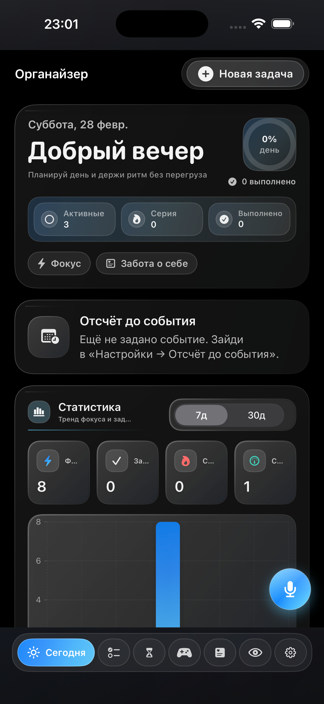
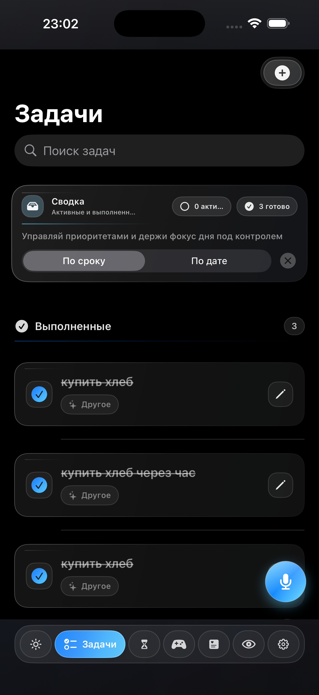
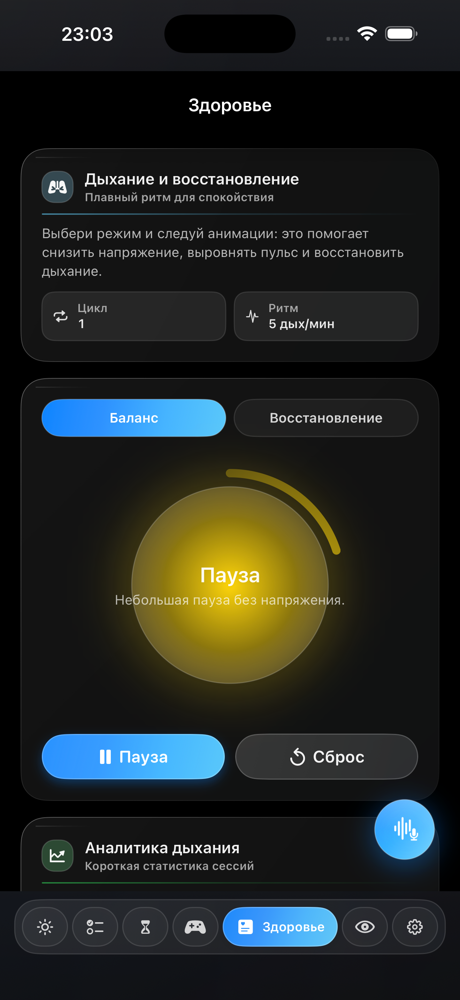
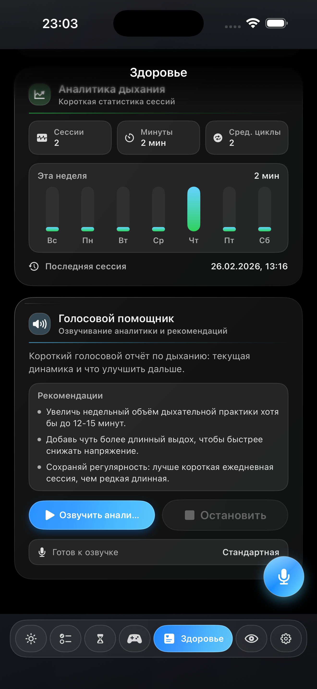
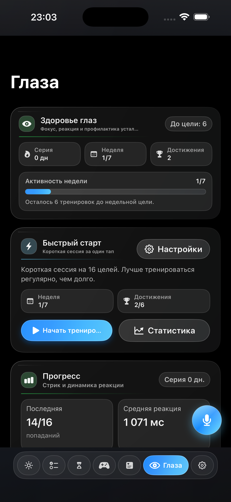
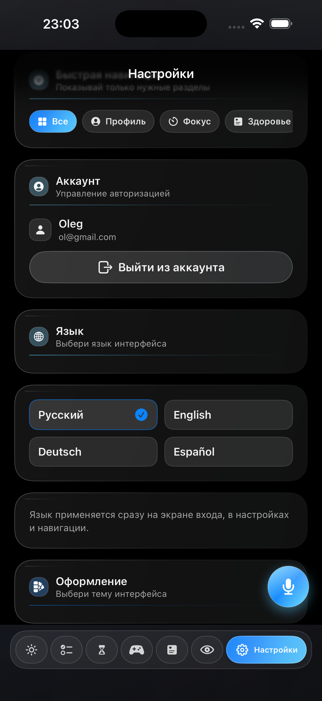

# Lippi

  
<strong>Personal focus, health routines, and voice assistance in one iPhone app.</strong>

  

    <a href="#english">English</a>
    ·
    <a href="#русский">Русский</a>
  

  

    
    
    
    
  

---

## Screenshots / Скриншоты

  
  
  

  
  
  

  

Home · Tasks · Health · Health Analytics · Eyes · Settings · Voice Assistant

---

## English

### Product Overview
Lippi is a polished iOS productivity and wellbeing app that combines task planning, Pomodoro focus sessions, eye-care breaks, breathing recovery, health analytics, and a built-in voice assistant.  
The goal is simple: help users stay focused, recover faster, and keep a sustainable daily rhythm.

### Key Features
- Daily workflow: task planning, "Today" screen, and quick progress tracking.
- Focus engine: Pomodoro sessions, customizable timer behavior, and ringtone selection.
- Health tools: eye exercise section, breathing and recovery routines, concise analytics.
- Voice assistant: fast in-app actions, command recognition, and spoken guidance.
- Widgets: home/lock-screen widgets with useful quick entry points.
- Personalization: dynamic themes, adaptive full-screen backgrounds, liquid-glass style.
- Localization: Russian, English, German, and Spanish across the app.

### Technical Highlights
- Modular feature structure (`Features`, `Core`, `UI`, `Widgets`).
- SwiftUI-first architecture with reusable design system components.
- WidgetKit integration for glanceable productivity and assistant access.
- Localized language environment and shared app/widget bridge keys.

### Project Structure
- `Lippi/` - main iOS app target
- `Lippi/Features/` - product features (Today, Tasks, Health, Assistant, Settings, etc.)
- `Lippi/Core/` - localization, auth, theme, shared services
- `Lippi/UI/` - design system and reusable visual components
- `LippiWidgets/`, `OrganizerWidget/` - widget extensions
- `LippiTests/`, `LippiUITests/` - tests

### Run Locally
1. Clone the repository.
2. Open `Lippi.xcodeproj` in Xcode.
3. Select the `Lippi` scheme.
4. Build and run on iPhone or Simulator with iOS 18.5+.

### Status
Active development. UI quality, performance smoothness, and assistant intelligence are continuously improved.

---

## Русский

### Описание продукта
Lippi - это аккуратное iOS-приложение для продуктивности и восстановления, которое объединяет планирование задач, Pomodoro-фокус, разминку глаз, дыхательные практики, аналитику здоровья и встроенного голосового помощника.  
Главная цель: помочь пользователю сохранять концентрацию, быстрее восстанавливаться и держать стабильный ритм дня.

### Ключевые возможности
- Ежедневная продуктивность: задачи, экран "Сегодня", быстрый контроль прогресса.
- Фокус-движок: Pomodoro-сессии, гибкие настройки таймера и выбор рингтонов.
- Инструменты здоровья: раздел для глаз, дыхание и восстановление, лаконичная аналитика.
- Голосовой помощник: быстрые команды внутри приложения и голосовые ответы.
- Виджеты: удобные виджеты для домашнего экрана и экрана блокировки.
- Персонализация: темы оформления, адаптивный фон на весь экран, liquid-glass стиль.
- Локализация: русский, английский, немецкий и испанский языки.

### Технические особенности
- Модульная структура (`Features`, `Core`, `UI`, `Widgets`).
- Архитектура на SwiftUI с переиспользуемой дизайн-системой.
- Интеграция с WidgetKit для быстрого доступа к ключевым функциям.
- Единая система локализации и общие ключи для связи приложения и виджетов.

### Структура проекта
- `Lippi/` - основной таргет iOS-приложения
- `Lippi/Features/` - модули функций (Today, Tasks, Health, Assistant, Settings и др.)
- `Lippi/Core/` - локализация, авторизация, темы, общие сервисы
- `Lippi/UI/` - дизайн-система и переиспользуемые визуальные компоненты
- `LippiWidgets/`, `OrganizerWidget/` - расширения виджетов
- `LippiTests/`, `LippiUITests/` - тесты

### Локальный запуск
1. Склонируйте репозиторий.
2. Откройте `Lippi.xcodeproj` в Xcode.
3. Выберите схему `Lippi`.
4. Запустите на iPhone или Simulator с iOS 18.5+.

### Статус
Проект активно развивается: улучшаются качество интерфейса, плавность работы и интеллект помощника.
