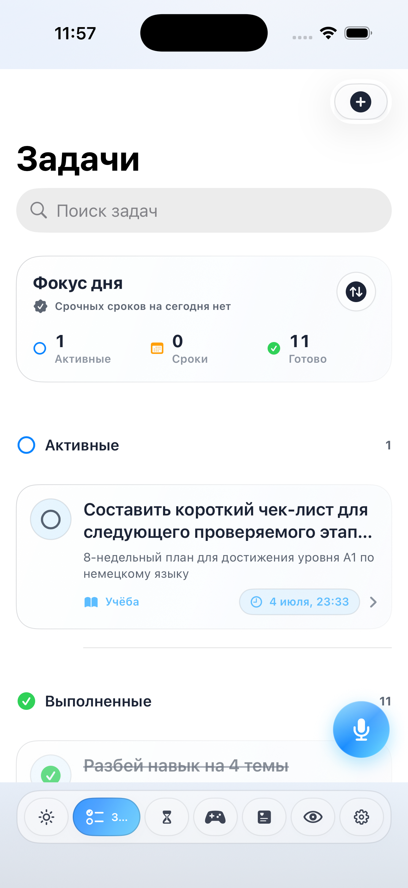
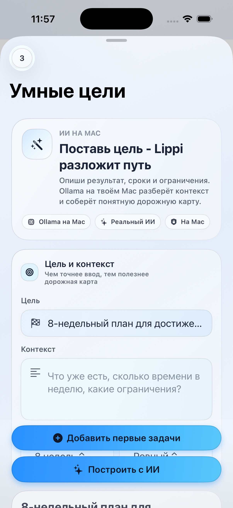
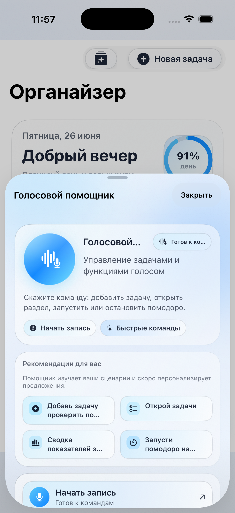
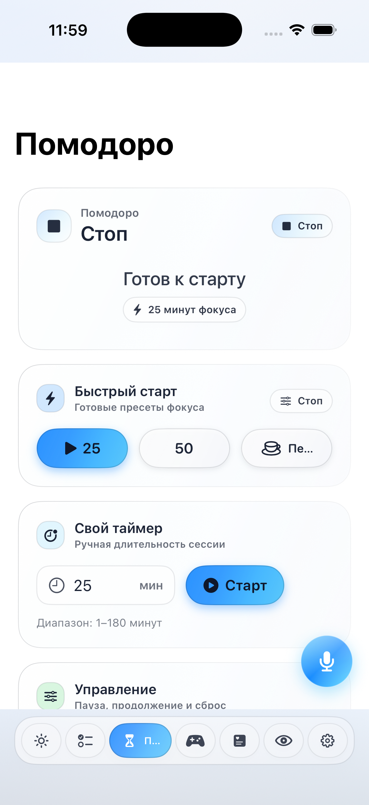
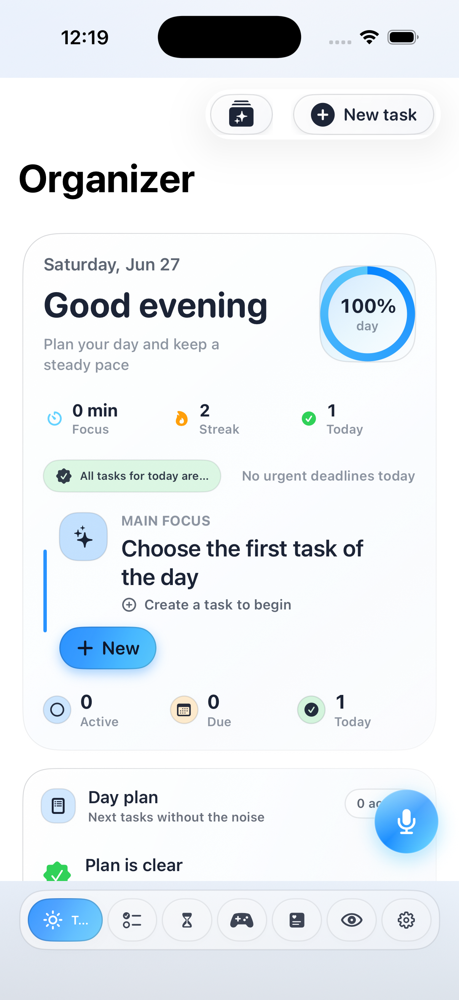
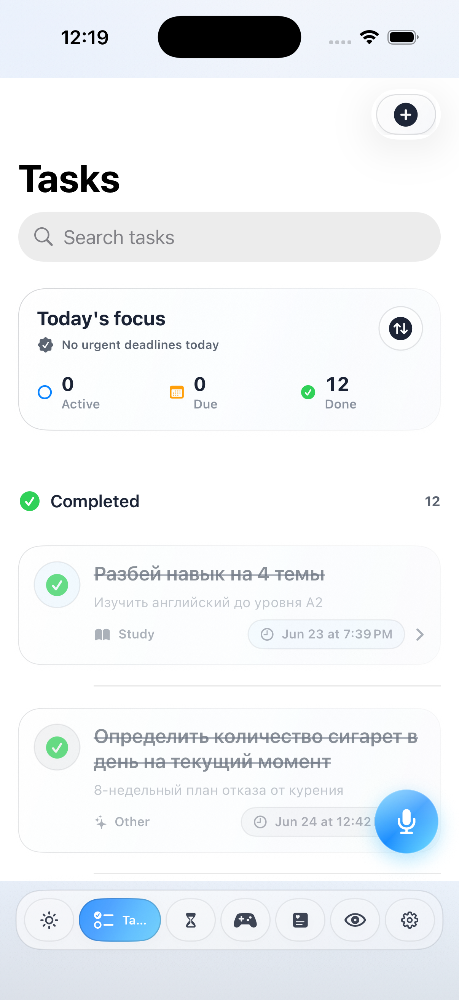
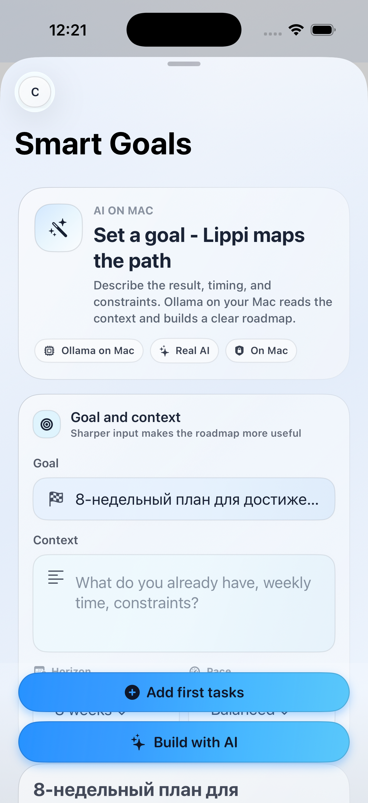
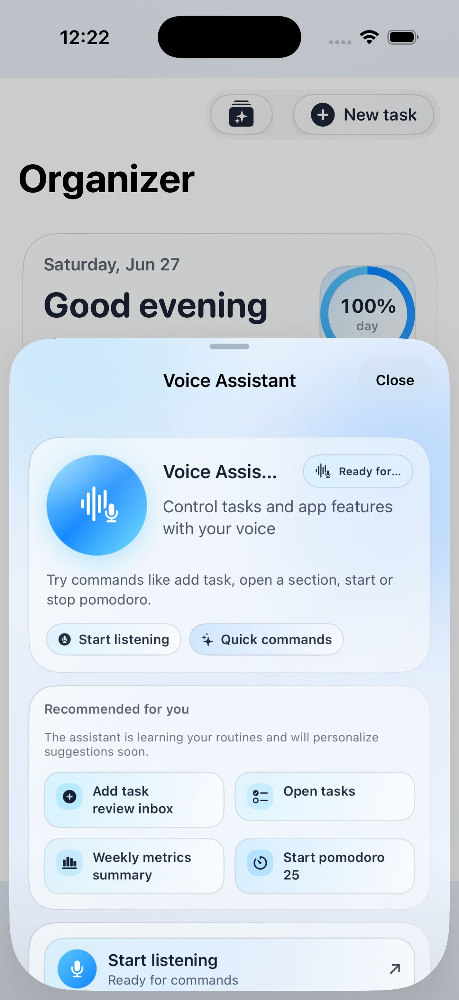
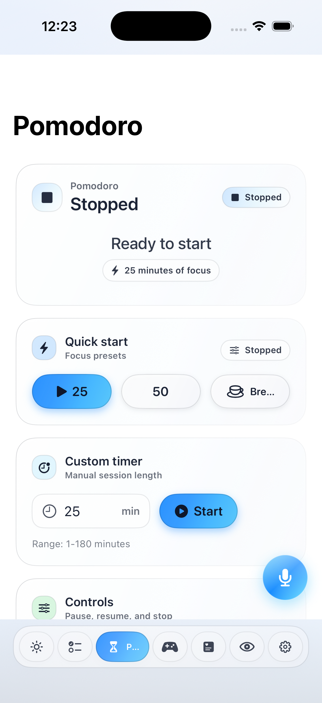

# Lippi

  
<strong>Personal focus, health routines, and voice assistance in one iPhone app.</strong>

  

    <a href="#english">English</a>
    ·
    <a href="#русский">Русский</a>
  

  

    
    
    
    
    
  

---

## License Notice / Лицензионное уведомление

<table>
  <tr>
    <td width="50%" align="left" valign="top">
      <strong>English</strong> 
      This repository is proprietary. Copying, modifying, building, using, and distributing the code without explicit written permission from the copyright holder is strictly prohibited.
        
      Full terms:
      <a href="LICENSE"><code>LICENSE (EN)</code></a>,
      <a href="LICENSE.ru.md"><code>LICENSE.ru.md (RU)</code></a>
    </td>
    <td width="50%" align="left" valign="top">
      <strong>Русский</strong> 
      Этот репозиторий является проприетарным. Копирование, изменение, сборка, использование и распространение кода без явного письменного разрешения правообладателя строго запрещены.
        
      Полные условия:
      <a href="LICENSE.ru.md"><code>LICENSE.ru.md (RU)</code></a>,
      <a href="LICENSE"><code>LICENSE (EN)</code></a>
    </td>
  </tr>
</table>

---

## Screenshots / Скриншоты

<strong>Русский интерфейс</strong>

  
  
  

  
  

Сегодня · Задачи · Умные цели · Голосовой помощник · Pomodoro

<strong>English interface</strong>

  
  
  

  
  

Today · Tasks · Smart Goals · Voice Assistant · Pomodoro

---

## Change History / История изменений

  

    
    
    
    
  

  
<strong>Beautiful, readable release notes for the current GitHub page.</strong>

  
<strong>Красивая и понятная история изменений для главной страницы репозитория.</strong>

<table>
  <tr>
    <td width="25%" align="center" valign="top">
      <strong>Chat-first goals</strong> 
      Goal setup, context, questions, and roadmap generation now happen in one Liquid Glass chat.
        
      <strong>Цели через чат</strong> 
      Постановка цели, контекст, вопросы и генерация карты идут в одном Liquid Glass-диалоге.
    </td>
    <td width="25%" align="center" valign="top">
      <strong>Grounded AI</strong> 
      The planner asks guiding questions, respects context, and rejects vague or invented roadmaps.
        
      <strong>Достоверный ИИ</strong> 
      Планировщик задаёт вопросы, учитывает контекст и отсекает общие или выдуманные планы.
    </td>
    <td width="25%" align="center" valign="top">
      <strong>Liquid Glass polish</strong> 
      Cards, controls, Dynamic Island states, and roadmap surfaces use cleaner system-glass styling.
        
      <strong>Больше Liquid Glass</strong> 
      Карточки, controls, Dynamic Island и дорожные карты получили более чистое системное стекло.
    </td>
    <td width="25%" align="center" valign="top">
      <strong>Smoother scrolling</strong> 
      Scroll-aware rendering reduces heavy effects during gestures and returns polish after settling.
        
      <strong>Плавный скролл</strong> 
      Во время жестов тяжёлые эффекты упрощаются и возвращаются после остановки.
    </td>
  </tr>
</table>

### July 7, 2026 - Source-aware AI roadmaps and friendly progress summaries

<table>
  <tr>
    <td width="50%" align="left" valign="top">
      <h3>English</h3>
      
<strong>This update makes Lippi's Smart Goals feel more like a thoughtful planning partner: it understands the goal domain, uses sources more carefully, and explains progress in a softer, more useful way.</strong>

      <ul>
        <li><strong>Source-aware roadmap model:</strong> the planner now classifies the user's goal as product, business, software, design, language, health, or general planning before building a route.</li>
        <li><strong>Better evidence handling:</strong> open references now include source type, planning purpose, match reason, and richer excerpts so the model can use sources as guidance without overstating them.</li>
        <li><strong>More grounded prompts:</strong> Ollama and Apple Foundation Models prompts now ask the model to separate facts, assumptions, missing details, constraints, and source boundaries before writing the roadmap.</li>
        <li><strong>Stronger roadmap quality gate:</strong> vague tasks, unsupported numbers, invented outcomes, duplicate work, and unclear success criteria are rejected before they reach the user.</li>
        <li><strong>Useful progress summaries:</strong> users can request a friendly AI summary of roadmap progress, visible task completion, focus rhythm, overdue items, and a gentle forecast based on their current state.</li>
        <li><strong>Weekly support loop:</strong> Lippi can schedule weekly progress-summary notifications and open Smart Goals directly into the summary flow.</li>
        <li><strong>Roadmap ready notification:</strong> after an AI roadmap is created, iPhone now receives a local notification so the user knows the plan is ready.</li>
        <li><strong>Russian and English polish:</strong> all new AI, progress, forecast, warning, and notification copy is localized for both languages.</li>
        <li><strong>Verification:</strong> the main <code>Lippi</code> app builds successfully for iOS Simulator.</li>
      </ul>
    </td>
    <td width="50%" align="left" valign="top">
      <h3>Русский</h3>
      
<strong>Это обновление делает «Умные цели» похожими на вдумчивого партнёра по планированию: Lippi лучше понимает тип цели, аккуратнее работает с источниками и мягче объясняет прогресс.</strong>

      <ul>
        <li><strong>ИИ с пониманием домена:</strong> планировщик сначала определяет тип цели: продукт, бизнес, разработка, дизайн, язык, здоровье или общий маршрут.</li>
        <li><strong>Умнее работа с источниками:</strong> открытые источники теперь передают тип, практическую роль, причину выбора и более насыщенные выдержки, чтобы модель использовала их как ориентир, а не как повод фантазировать.</li>
        <li><strong>Более заземлённые промпты:</strong> Ollama и Apple Foundation Models теперь сначала разделяют факты, допущения, недостающий контекст, ограничения и границы источников.</li>
        <li><strong>Строже проверка дорожных карт:</strong> расплывчатые задачи, неподтверждённые числа, выдуманные результаты, повторы и неясные критерии успеха отсекаются до показа пользователю.</li>
        <li><strong>Полезная сводка прогресса:</strong> пользователь может запросить дружелюбный AI-анализ прогресса по карте, задачам, фокусу, просрочкам и мягкому прогнозу с учётом текущего состояния.</li>
        <li><strong>Еженедельное сопровождение:</strong> Lippi умеет планировать еженедельные уведомления со сводкой и открывать «Умные цели» сразу в сценарий анализа прогресса.</li>
        <li><strong>Уведомление о готовой карте:</strong> после построения дорожной карты через ИИ iPhone получает локальное уведомление, что план готов.</li>
        <li><strong>Полировка RU/EN:</strong> все новые тексты про ИИ, прогресс, прогноз, предупреждения и уведомления добавлены на русском и английском.</li>
        <li><strong>Проверка:</strong> основное приложение <code>Lippi</code> успешно собирается для iOS Simulator.</li>
      </ul>
    </td>
  </tr>
</table>

### July 7, 2026 - Readable productivity pulse and stable widget launches

<table>
  <tr>
    <td width="50%" align="left" valign="top">
      <h3>English</h3>
      
<strong>This update makes the Today screen easier to understand at a glance and removes a noisy Xcode widget-host launch failure.</strong>

      <ul>
        <li><strong>Productivity Pulse:</strong> the old abstract statistics chart was rebuilt into a clear dashboard for focus, completed tasks, streak, and average daily focus.</li>
        <li><strong>Human-readable insight:</strong> Lippi now summarizes the period with a rhythm score, active-day count, total focus time, and completed task count.</li>
        <li><strong>Clear visual language:</strong> blue bars now mean focus time, green marks mean completed tasks, and the legend explains the chart directly inside the card.</li>
        <li><strong>Better interaction:</strong> tapping a day reveals that day's summary instead of leaving the user to decode the graph alone.</li>
        <li><strong>More beautiful Liquid Glass:</strong> the metric tiles, rhythm ring, and timeline now use softer glass, clearer hierarchy, and calmer depth.</li>
        <li><strong>Widget launch fix:</strong> shared widget schemes no longer ask Xcode to show a Notification Center widget host after build, preventing the <code>Show Notification Center Widget timed out</code> error.</li>
        <li><strong>Verification:</strong> <code>Lippi</code>, <code>LippiWidgetsExtension</code>, and <code>OrganizerWidgetExtension</code> all build successfully for iOS Simulator.</li>
      </ul>
    </td>
    <td width="50%" align="left" valign="top">
      <h3>Русский</h3>
      
<strong>Это обновление делает главный экран понятнее с первого взгляда и убирает шумную ошибку запуска widget-host в Xcode.</strong>

      <ul>
        <li><strong>Пульс продуктивности:</strong> старый абстрактный график статистики заменён на понятную панель фокуса, закрытых задач, серии и среднего фокуса за день.</li>
        <li><strong>Человеческий вывод:</strong> Lippi теперь кратко объясняет период через ритм, активные дни, общее время фокуса и количество выполненных задач.</li>
        <li><strong>Понятный визуальный язык:</strong> синие столбики означают фокус, зелёные метки — выполненные задачи, а легенда объясняет это прямо внутри карточки.</li>
        <li><strong>Лучшее взаимодействие:</strong> по нажатию на день пользователь видит сводку этого дня, а не пытается самостоятельно расшифровать график.</li>
        <li><strong>Красивее Liquid Glass:</strong> плитки метрик, кольцо ритма и шкала дней получили мягкое стекло, понятную иерархию и спокойную глубину.</li>
        <li><strong>Исправлен запуск виджетов:</strong> shared-схемы виджетов больше не заставляют Xcode открывать Notification Center widget host после сборки, что устраняет ошибку <code>Show Notification Center Widget timed out</code>.</li>
        <li><strong>Проверка:</strong> <code>Lippi</code>, <code>LippiWidgetsExtension</code> и <code>OrganizerWidgetExtension</code> успешно собираются для iOS Simulator.</li>
      </ul>
    </td>
  </tr>
</table>

### July 6, 2026 - Glass widgets, compact Dynamic Island, and stable widget installation

<table>
  <tr>
    <td width="50%" align="left" valign="top">
      <h3>English</h3>
      
<strong>This update polishes how Lippi appears outside the app: on the Home Screen, in widgets, and inside Dynamic Island.</strong>

      <ul>
        <li><strong>Cleaner Home Screen widgets:</strong> widget layouts were rebuilt with brighter Liquid Glass surfaces, softer depth, and no heavy black frame around the content.</li>
        <li><strong>Better text fitting:</strong> task names, timers, overdue labels, and compact status text now use tighter layout rules so important information stays readable in small widget sizes.</li>
        <li><strong>More useful widget hierarchy:</strong> active tasks, focus states, Pomodoro, assistant entry points, and roadmap widgets now prioritize the most important detail first.</li>
        <li><strong>Compact Dynamic Island states:</strong> Live Activities now keep the collapsed island small and quiet, so it no longer stretches across the status indicators before the user expands it.</li>
        <li><strong>Refined Island visuals:</strong> Pomodoro, roadmap, and organizer activities received lighter compact icons, cleaner margins, and calmer glass styling for the expanded state.</li>
        <li><strong>Fixed extension install conflict:</strong> the Organizer widget scheme now launches the containing <code>Lippi.app</code> instead of trying to install the <code>.appex</code> directly.</li>
        <li><strong>Verification:</strong> <code>Lippi</code>, <code>LippiWidgetsExtension</code>, and <code>OrganizerWidgetExtension</code> all build successfully for iOS Simulator.</li>
      </ul>
    </td>
    <td width="50%" align="left" valign="top">
      <h3>Русский</h3>
      
<strong>Это обновление доводит до блеска то, как Lippi выглядит вне приложения: на рабочем столе, в виджетах и Dynamic Island.</strong>

      <ul>
        <li><strong>Чище виджеты на рабочем столе:</strong> layout виджетов переработан под более светлые Liquid Glass-поверхности, мягкую глубину и без тяжелой черной рамки вокруг контента.</li>
        <li><strong>Текст лучше помещается:</strong> названия задач, таймеры, просрочки и компактные статусы получили более строгие правила верстки, чтобы важная информация читалась даже в маленьких виджетах.</li>
        <li><strong>Понятнее иерархия:</strong> активные задачи, фокус, Pomodoro, вход в ассистента и дорожные карты теперь сначала показывают самое важное, а второстепенное не перегружает поверхность.</li>
        <li><strong>Компактный Dynamic Island:</strong> Live Activities в свернутом состоянии занимают минимум места и больше не растягивают остров до индикаторов сети и заряда.</li>
        <li><strong>Аккуратнее визуал острова:</strong> Pomodoro, roadmap и organizer-активности получили более легкие компактные иконки, чистые отступы и спокойное стекло в раскрытом состоянии.</li>
        <li><strong>Исправлен конфликт установки расширения:</strong> схема Organizer widget теперь запускает контейнер <code>Lippi.app</code>, а не пытается установить <code>.appex</code> напрямую.</li>
        <li><strong>Проверка:</strong> <code>Lippi</code>, <code>LippiWidgetsExtension</code> и <code>OrganizerWidgetExtension</code> успешно собираются для iOS Simulator.</li>
      </ul>
    </td>
  </tr>
</table>

### July 3, 2026 - Full-screen Liquid Glass, calmer motion, and smarter navigation

<table>
  <tr>
    <td width="50%" align="left" valign="top">
      <h3>English</h3>
      
<strong>This release makes Lippi feel more native, calmer, and easier to read across the whole app.</strong>

      <ul>
        <li><strong>True full-screen app shell:</strong> the root app states, launch/auth flow, background, and main interface now occupy the full display area.</li>
        <li><strong>Bottom toolbar inside the app scene:</strong> the navigation bar now lives as a full-screen overlay instead of a detached safe-area inset, while still respecting the home indicator.</li>
        <li><strong>Denser Liquid Glass toolbar:</strong> the bottom bar received a stronger frosted base, clearer tint, better outline, and deeper shadow so it stays readable on bright and complex backgrounds.</li>
        <li><strong>Cleaner navigation:</strong> only the three primary destinations stay visible - Today, Tasks, and Pomodoro. Breaks, Health, Eyes, and Settings are tucked into a compact overflow menu.</li>
        <li><strong>Calmer motion:</strong> the distracting left-to-right breathing/sheen animation was removed from shared glass surfaces. The interface keeps polish without visual noise.</li>
        <li><strong>Less clutter:</strong> the manual "To Island" buttons were removed from Today and Countdown. Dynamic Island support remains available where it belongs in the system flow.</li>
        <li><strong>ProMotion-oriented responsiveness:</strong> shared animation timing and isolated display-sync views were tuned for smoother 60/120 Hz rendering while keeping heavy effects quiet during scrolling.</li>
        <li><strong>More resilient Smart Goals:</strong> the roadmap planner better accounts for overdue or stalled tasks and can suggest realistic plan corrections instead of pretending everything is on track.</li>
        <li><strong>Verification:</strong> the code was checked with <code>git diff --check</code> and multiple successful <code>xcodebuild build</code> runs.</li>
      </ul>
    </td>
    <td width="50%" align="left" valign="top">
      <h3>Русский</h3>
      
<strong>Этот релиз делает Lippi более нативным, спокойным и удобным для восприятия на всех основных экранах.</strong>

      <ul>
        <li><strong>Настоящий полноэкранный интерфейс:</strong> корневые состояния приложения, вход, загрузка, фон и основной интерфейс теперь занимают всю площадь дисплея.</li>
        <li><strong>Нижний тулбар внутри сцены:</strong> меню навигации больше не живет отдельной safe-area-вставкой, а находится в полноэкранном слое приложения и аккуратно учитывает home indicator.</li>
        <li><strong>Более плотный Liquid Glass toolbar:</strong> нижняя панель получила более матовую стеклянную основу, заметный tint, читаемый контур и глубже тень, чтобы не растворяться на сложном фоне.</li>
        <li><strong>Лаконичная навигация:</strong> в поле зрения остались только три главные кнопки - «Сегодня», «Задачи» и Pomodoro. Перерывы, здоровье, глаза и настройки спрятаны в компактное меню.</li>
        <li><strong>Спокойнее анимации:</strong> убран отвлекающий проходящий слева направо «дышащий» блик на стеклянных поверхностях. Интерфейс остался живым, но без визуального шума.</li>
        <li><strong>Меньше лишних кнопок:</strong> кнопки «В остров» удалены из Today и Countdown. Поддержка Dynamic Island сохранена в системных сценариях, где она действительно нужна.</li>
        <li><strong>Плавность под ProMotion:</strong> общая система анимаций и отдельные display-sync элементы настроены для более гладкого рендера на 60/120 Гц, а тяжелые эффекты успокаиваются во время скролла.</li>
        <li><strong>Умнее «Умные цели»:</strong> планировщик лучше учитывает просроченные и зависшие задачи и может предлагать реалистичную корректировку плана, а не делать вид, что все идет идеально.</li>
        <li><strong>Проверка:</strong> код проверен через <code>git diff --check</code> и несколько успешных запусков <code>xcodebuild build</code>.</li>
      </ul>
    </td>
  </tr>
</table>

### June 29, 2026 - Smart Goals Chat, Adaptive Roadmaps, and 60 FPS Polish

<table>
  <tr>
    <td width="50%" align="left" valign="top">
      <h3>English</h3>
      
<strong>This update turns Smart Goals into a calm chat experience and makes the roadmap engine more useful, contextual, and responsive.</strong>

      <ul>
        <li><strong>Chat-first Smart Goals:</strong> the "Smart Goals" window now opens as a full Liquid Glass conversation. The user writes the goal, answers follow-up questions, chooses horizon and pace, and starts generation without leaving the chat.</li>
        <li><strong>Guiding questions before planning:</strong> Lippi asks practical questions about the starting point, weekly capacity, success metric, deadline, constraints, blockers, first checkpoint, and review cadence.</li>
        <li><strong>Context-aware roadmap generation:</strong> the model must answer in the user's request language, separate known facts from assumptions, and include two or three clarifying questions for future support.</li>
        <li><strong>Adaptive support:</strong> when tracked Lippi tasks show overdue or stalled progress, the planner can reduce the nearest workload, split blocked items, and suggest a gentler correction instead of restarting blindly.</li>
        <li><strong>Quality gate for AI output:</strong> vague tasks, duplicate phases, unsupported metrics, invented demand, revenue, health guarantees, and missing clarifying questions are rejected before the roadmap reaches the UI.</li>
        <li><strong>Mac Ollama planner:</strong> the local provider keeps a stricter system role, structured JSON schema, repair prompt, and grounded planning contract for more reliable roadmaps.</li>
        <li><strong>Readable roadmap UI:</strong> generated text, milestones, assumptions, risks, evidence, and support questions are laid out in comfortable Liquid Glass sections for long AI responses.</li>
        <li><strong>60 FPS-oriented rendering:</strong> shared scroll surfaces report drag and deceleration phases. During scroll, expensive glass layers, deep shadows, and background details switch to a lighter path, then return after the gesture settles.</li>
        <li><strong>Cleaner daily surfaces:</strong> the Today and Important Now areas keep the interface quieter, remove visual divider noise, and prioritize immediately useful information.</li>
        <li><strong>Verification:</strong> code was checked with <code>git diff --check</code>, <code>xcodebuild build</code>, and <code>xcodebuild build-for-testing</code>.</li>
      </ul>
    </td>
    <td width="50%" align="left" valign="top">
      <h3>Русский</h3>
      
<strong>Это обновление превращает «Умные цели» в спокойный чат и делает построение дорожных карт более полезным, контекстным и отзывчивым.</strong>

      <ul>
        <li><strong>Умные цели целиком через чат:</strong> окно «Умные цели» теперь открывается как полноценный Liquid Glass-диалог. Пользователь пишет цель, отвечает на уточнения, выбирает горизонт и темп, а затем запускает генерацию в этом же чате.</li>
        <li><strong>Наводящие вопросы до планирования:</strong> Lippi спрашивает о текущей точке, времени в неделю, критерии успеха, сроке, ограничениях, возможных блокерах, первом контрольном результате и частоте пересмотра плана.</li>
        <li><strong>Контекстная генерация дорожной карты:</strong> модель отвечает на языке запроса пользователя, отделяет известные факты от допущений и возвращает 2-3 уточняющих вопроса для дальнейшего сопровождения.</li>
        <li><strong>Адаптивное сопровождение:</strong> если задачи Lippi показывают просрочку или застой, планировщик может уменьшить ближайшую нагрузку, разбить заблокированные пункты и предложить более мягкую корректировку.</li>
        <li><strong>Quality gate для ответа ИИ:</strong> общие задачи, повторяющиеся этапы, неподтверждённые метрики, выдуманные спрос/выручка, медицинские гарантии и отсутствие уточняющих вопросов отсекаются до показа карты.</li>
        <li><strong>Ollama-планировщик на Mac:</strong> локальный провайдер получил более строгую роль, JSON Schema, repair prompt и grounded planning contract для более надёжных дорожных карт.</li>
        <li><strong>Читаемый интерфейс карты:</strong> сгенерированный текст, этапы, допущения, риски, источники и вопросы сопровождения разложены в удобные Liquid Glass-блоки для длинных ответов ИИ.</li>
        <li><strong>Рендеринг под 60 FPS:</strong> основные прокручиваемые экраны передают drag и deceleration-фазы. Во время скролла тяжёлые glass-слои, глубокие тени и детали фона временно упрощаются, а после жеста возвращаются.</li>
        <li><strong>Более спокойные ежедневные экраны:</strong> Today и «Важное сейчас» стали чище, без лишнего визуального шума и с приоритетом на информацию, которая нужна пользователю сразу.</li>
        <li><strong>Проверка:</strong> код проверен через <code>git diff --check</code>, <code>xcodebuild build</code> и <code>xcodebuild build-for-testing</code>.</li>
      </ul>
    </td>
  </tr>
</table>

  
<strong>Previous milestone / Предыдущее крупное обновление</strong>

   
  <table>
    <tr>
      <td width="50%" align="left" valign="top">
        <strong>English</strong> 
        Earlier updates introduced the bilingual screenshot gallery, Today overview redesign, Important Now panel, readable roadmap sections, Dynamic Island roadmap activity, Mac-first Ollama provider, local Piper neural voice, and stronger Liquid Glass styling across the app.
      </td>
      <td width="50%" align="left" valign="top">
        <strong>Русский</strong> 
        Ранее были добавлены двуязычная галерея скриншотов, редизайн Today, панель «Важное сейчас», читаемые блоки дорожной карты, активность Dynamic Island, Ollama на Mac, локальный нейро-голос Piper и более выразительный Liquid Glass по всему приложению.
      </td>
    </tr>
  </table>

---

## English

### Product Overview
Lippi is a polished iOS productivity and wellbeing app that combines task planning, Pomodoro focus sessions, eye-care breaks, breathing recovery, health analytics, and a built-in voice assistant.  
The goal is simple: help users stay focused, recover faster, and keep a sustainable daily rhythm.

### Key Features
- Daily workflow: task planning, "Today" screen, and quick progress tracking.
- Focus engine: Pomodoro sessions, customizable timer behavior, and ringtone selection.
- Health tools: eye exercise section, breathing and recovery routines, concise analytics.
- Voice assistant: fast in-app actions, command recognition, and spoken guidance.
- Neural voice option: a local Mac Piper provider with a feminine Russian model and a system-speech fallback.
- Widgets: home/lock-screen widgets with useful quick entry points.
- Personalization: dynamic themes, adaptive full-screen backgrounds, liquid-glass style.
- Localization: Russian, English, German, and Spanish across the app.

### Technical Highlights
- Modular feature structure (`Features`, `Core`, `UI`, `Widgets`).
- SwiftUI-first architecture with reusable design system components.
- WidgetKit integration for glanceable productivity and assistant access.
- Localized language environment and shared app/widget bridge keys.

### Project Structure
- `Lippi/` - main iOS app target
- `Lippi/Features/` - product features (Today, Tasks, Health, Assistant, Settings, etc.)
- `Lippi/Core/` - localization, auth, theme, shared services
- `Lippi/UI/` - design system and reusable visual components
- `LippiWidgets/`, `OrganizerWidget/` - widget extensions
- `LippiTests/`, `LippiUITests/` - tests

### Run Locally
1. Clone the repository.
2. Open `Lippi.xcodeproj` in Xcode.
3. Select the `Lippi` scheme.
4. Build and run on iPhone or Simulator with iOS 18.5+.
5. For local neural speech, run `./Scripts/install-local-tts.zsh` once on the Mac. Xcode then starts the provider automatically; enable it in Settings -> Health and keep the iPhone and Mac on the same Wi-Fi network.

### Status
Active development. UI quality, performance smoothness, and assistant intelligence are continuously improved.

### License
Proprietary software. All rights reserved.  
Copying, modifying, building, using, and distributing this project are strictly prohibited for third parties without explicit written permission from the copyright holder.  
Full texts: `LICENSE` (English), `LICENSE.ru.md` (Russian).

---

## Русский

### Описание продукта
Lippi - это аккуратное iOS-приложение для продуктивности и восстановления, которое объединяет планирование задач, Pomodoro-фокус, разминку глаз, дыхательные практики, аналитику здоровья и встроенного голосового помощника.  
Главная цель: помочь пользователю сохранять концентрацию, быстрее восстанавливаться и держать стабильный ритм дня.

### Ключевые возможности
- Ежедневная продуктивность: задачи, экран "Сегодня", быстрый контроль прогресса.
- Фокус-движок: Pomodoro-сессии, гибкие настройки таймера и выбор рингтонов.
- Инструменты здоровья: раздел для глаз, дыхание и восстановление, лаконичная аналитика.
- Голосовой помощник: быстрые команды внутри приложения и голосовые ответы.
- Нейро-голос: локальный провайдер Piper на Mac с женской русской моделью и резервным системным голосом.
- Виджеты: удобные виджеты для домашнего экрана и экрана блокировки.
- Персонализация: темы оформления, адаптивный фон на весь экран, liquid-glass стиль.
- Локализация: русский, английский, немецкий и испанский языки.

### Технические особенности
- Модульная структура (`Features`, `Core`, `UI`, `Widgets`).
- Архитектура на SwiftUI с переиспользуемой дизайн-системой.
- Интеграция с WidgetKit для быстрого доступа к ключевым функциям.
- Единая система локализации и общие ключи для связи приложения и виджетов.

### Структура проекта
- `Lippi/` - основной таргет iOS-приложения
- `Lippi/Features/` - модули функций (Today, Tasks, Health, Assistant, Settings и др.)
- `Lippi/Core/` - локализация, авторизация, темы, общие сервисы
- `Lippi/UI/` - дизайн-система и переиспользуемые визуальные компоненты
- `LippiWidgets/`, `OrganizerWidget/` - расширения виджетов
- `LippiTests/`, `LippiUITests/` - тесты

### Локальный запуск
1. Склонируйте репозиторий.
2. Откройте `Lippi.xcodeproj` в Xcode.
3. Выберите схему `Lippi`.
4. Запустите на iPhone или Simulator с iOS 18.5+.
5. Для локальной нейро-озвучки один раз выполните `./Scripts/install-local-tts.zsh` на Mac. Затем Xcode запускает провайдер автоматически; включите его в Настройках -> Здоровье и держите iPhone и Mac в одной Wi-Fi сети.

### Статус
Проект активно развивается: улучшаются качество интерфейса, плавность работы и интеллект помощника.

### Лицензия
Проприетарное ПО. Все права защищены.  
Копирование, изменение, сборка, использование и распространение проекта третьими лицами строго запрещены без явного письменного разрешения правообладателя.  
Полные тексты: `LICENSE.ru.md` (русский), `LICENSE` (английский).
