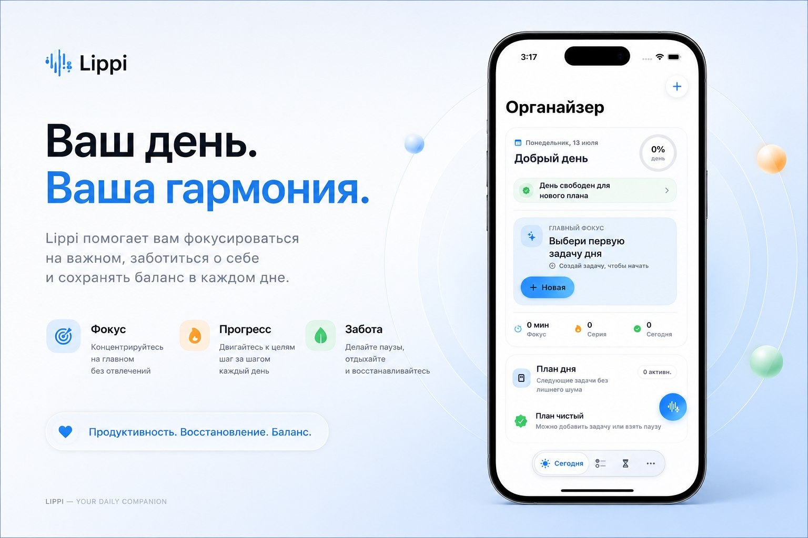
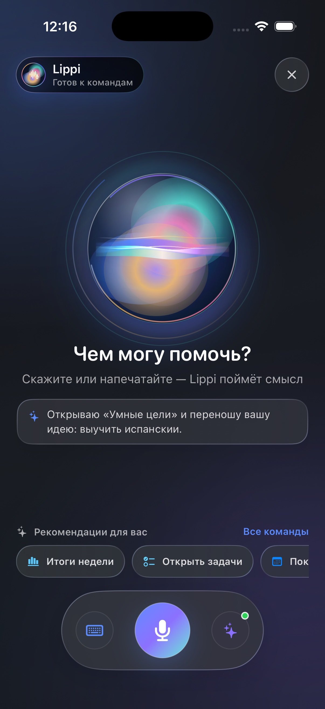
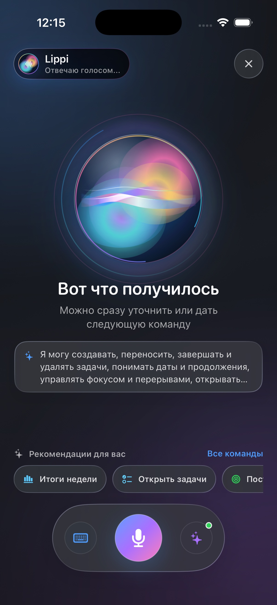
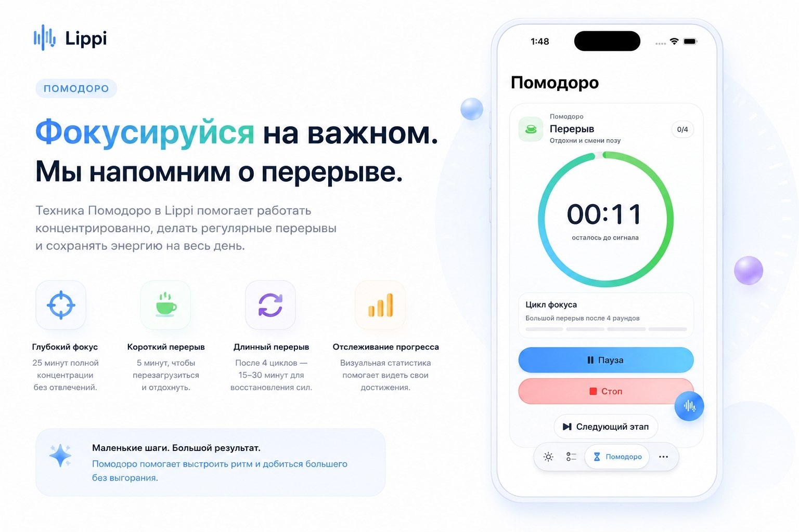
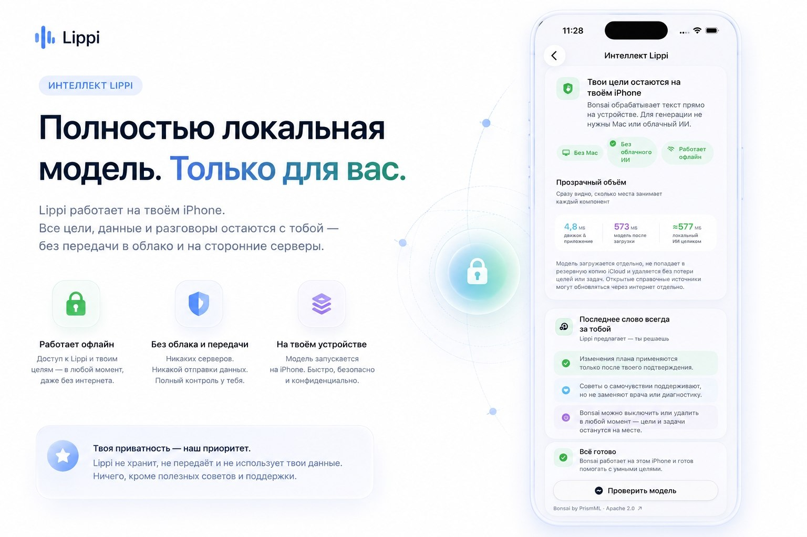
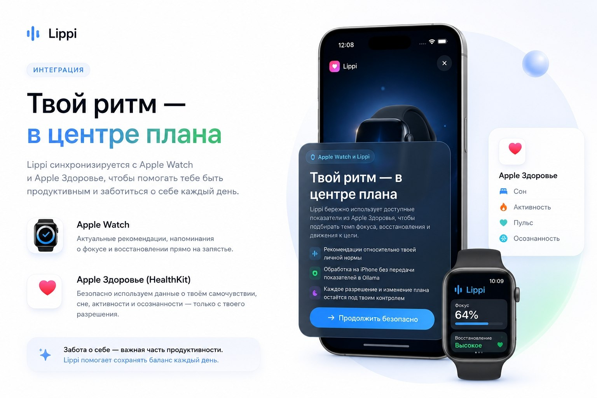
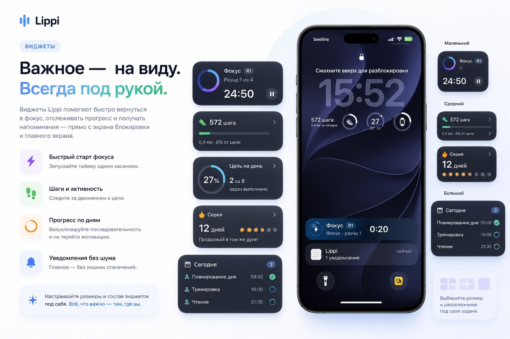

<div align="center">


# Lippi

### Focus deeply. Recover gently. Reach meaningful goals without overload.

**Осознанный фокус, бережное восстановление и движение к важным целям без перегруза.**

<p>
  <a href="https://lippi.lenuma.ru">
    
  </a>
</p>

### [Открыть официальный сайт Lippi →](https://lippi.lenuma.ru)

**Познакомьтесь с возможностями Lippi, умными целями, локальным интеллектом, голосовым помощником и интеграцией с Apple Watch — в одной цельной интерактивной презентации.**

<p>
  
  
  
</p>
<p>
  
  
  
  
  
  
  
  
  
  
  
  
  
  
  
  
  
  
  
  
  
  
  
  
  
  
  
  
  
  
  
</p>

[Возможности](#возможности) · [Последнее обновление](#последнее-обновление--latest-release) · [Архитектура](#архитектура--architecture) · [Запуск](#локальный-запуск--run-locally) · [Сайт](https://lippi.lenuma.ru) · [Privacy](https://lippi.lenuma.ru/privacy) · [English](#english) · [Changelog](CHANGELOG.md)

</div>

---

## Lippi в одном взгляде

Lippi объединяет планирование, фокус и восстановление в одном спокойном iPhone-приложении. Вместо бесконечного списка требований пользователь видит понятный следующий шаг, а темп может бережно адаптироваться по прогрессу, самочувствию и разрешённым данным Apple Здоровья.

<table>
  <tr>
    <td width="50%" valign="top">
      <strong>🎯 Умные цели</strong><br>
      Понятный маршрут от исходной точки до проверяемого результата.<br>
      <sub>A clear first action and a path that can be followed.</sub>
    </td>
    <td width="50%" valign="top">
      <strong>⏱️ Фокус</strong><br>
      Pomodoro, задачи и ясный план дня без визуального шума.<br>
      <sub>Calm sessions and contextual controls.</sub>
    </td>
  </tr>
  <tr>
    <td width="50%" valign="top">
      <strong>❤️ Здоровье</strong><br>
      HealthKit, полноценный Apple Watch companion и единый ритм заботы.<br>
      <sub>Contextual care that follows the day.</sub>
    </td>
    <td width="50%" valign="top">
      <strong>✨ Помощник</strong><br>
      Голосовые команды и быстрые действия без лишней навигации.<br>
      <sub>Voice assistance one tap away.</sub>
    </td>
  </tr>
</table>

## Возможности

| Раздел | Что получает пользователь |
|---|---|
| **Сегодня** | Спокойный обзор дня, главный фокус и «Ритм заботы», который выбирает один уместный следующий шаг. |
| **Календарь** | Нажатие на дату раскрывает прямо из её ячейки стеклянную сводку с событиями, временем, заметками и прогрессом дня; кольца на числах и общая дорожка показывают движение к умной цели. |
| **Умные цели** | Даже если пользователь не знает, с чего начать, Lippi превращает пожелания, исходную точку и ограничения в предметный маршрут: первое действие, наблюдаемые результаты этапов и финальную проверку цели. |
| **Задачи и Pomodoro** | Персональный ритм фокуса и отдыха учитывает историю сессий, ближайший шаг умной цели, отмеченное состояние и доступные сигналы восстановления. |
| **Здоровье** | Разрешённые показатели активности, сна, восстановления, воды и питания из HealthKit превращаются в осторожные и объяснимые рекомендации. |
| **Apple Watch** | Отдельное приложение показывает текущую рекомендацию, фокус, шаг к цели и принимает быстрые отметки воды, еды, движения и отдыха. |
| **Восстановление** | Дыхательные практики и минутное упражнение для глаз из шести мягких фаз. При недоступной камере Lippi сразу переходит к полностью бескамерному сценарию, а на iOS 26 системный световой бегунок продолжает двигаться в Live Activity и Dynamic Island без фоновой работы приложения. |
| **Голосовой помощник** | Составные просьбы, даты и продолжения разговора; локальные голоса F2 и M3 получают точные ударения, контекстное разрешение омографов и непрерывную мелодику без внутренних аудиосклеек, сохраняя адаптацию к осторожно оценённому физиологическому контексту. |
| **Знакомство с Lippi** | Четыре интерактивных шага, осмысленный выбор темпа и видимая автоматическая подготовка локальной модели уже при первом запуске. |
| **Виджеты** | Единый новый дизайн задач, плана дня, Pomodoro и помощника на Home Screen, Lock Screen, в Live Activities и Dynamic Island. |

## Принципы продукта

- **Спокойствие по умолчанию.** Один главный акцент на экран, короткие подписи и постепенное раскрытие деталей.
- **Пользователь управляет планом.** Lippi предлагает изменения, объясняет причины и применяет их только после подтверждения.
- **Приватность HealthKit.** Показатели обрабатываются на устройстве и не добавляются в запросы к внешним AI-провайдерам.
- **Плавность важнее декора.** При прокрутке качество материалов остаётся неизменным, а нагрузка снижается за счёт частоты непрерывных анимаций — без заметной подмены интерфейса.
- **Доступность встроена.** Dynamic Type, VoiceOver, Reduce Motion и Reduce Transparency учитываются общей дизайн-системой.

[Политика конфиденциальности Lippi →](https://lippi.lenuma.ru/privacy)

## Последнее обновление · Latest release

### 11 августа 2026 — Каждое слово — на своём месте. Забота — без условий.

Lippi стала звучать цельнее и заботиться спокойнее. Русская речь теперь доходит до локальной модели с явными ударениями и контекстом сложных слов, а мелодика проходит через фразу непрерывно — без внутренних разрезов, которые могли звучать как повтор слога или заикание. Упражнение для глаз больше не зависит от камеры, а световой ориентир в Dynamic Island действительно движется средствами самой системы.

<table>
  <tr>
    <td width="25%" align="center" valign="top">
      <strong>Á Ударение знает слово</strong><br><br>
      Частые формы, даты, команды и орфоэпические ловушки получают проверяемый акцент.<br><br>
      <sub>The right stress, at the right place.</sub>
    </td>
    <td width="25%" align="center" valign="top">
      <strong>〰 Фраза звучит цельно</strong><br><br>
      Высота тона меняется одной плавной траекторией, не разрезая фонемы на части.<br><br>
      <sub>One phrase. One continuous motion.</sub>
    </td>
    <td width="25%" align="center" valign="top">
      <strong>◉ Минута без камеры</strong><br><br>
      Шесть мягких фаз работают без разрешения, оценки результата и касаний экрана.<br><br>
      <sub>Private care, always available.</sub>
    </td>
    <td width="25%" align="center" valign="top">
      <strong>→ Свет действительно движется</strong><br><br>
      Live Activity использует системное время и остаётся живой, когда приложение спит.<br><br>
      <sub>Motion rendered by iOS.</sub>
    </td>
  </tr>
</table>

- **Точные ударения доходят до синтеза.** Отдельный слой произношения готовит текст именно для локальной character-level модели: ставит явный акут, сохраняет `ё` и `й` через поддерживаемые комбинируемые знаки и не меняет читаемый текст интерфейса.
- **Словарь осторожный, а не самоуверенный.** Проверенные формы покрывают действия помощника, календарь, числа, единицы, здоровье, цели и частые орфоэпические ловушки. Незнакомое слово остаётся без догадки, если Lippi не может поставить ударение надёжно.
- **Омографы понимают ближайший смысл.** `за́мок / замо́к`, `пла́чу / плачу́` и `му́ка / мука́` выбираются по словам рядом. Уже заданное автором ударение сохраняется и не дублируется.
- **Вопросы больше не звучат одинаково.** Вопрос «да или нет» получает сдержанный подъём, а открытые вопросы на русском, английском, немецком и испанском естественно разрешаются к завершению фразы.
- **Без внутренних швов и заиканий.** Прежние три независимых участка pitch-shift заменены одной непрерывной временной деформацией с плавной интерполяцией. Коартикуляция сохраняется на всей фразе, тихие атаки и окончания не обрезаются, а DC-смещение удаляется до обработки.
- **Ударная гласная получает реальное время.** Явный акцент участвует в локальной длительности и микродинамике готового PCM. Смысловой акцент при этом избегает служебных слов и учитывает отрицание, финальную позицию и слова-подсказки.
- **Качество повышено во всём разговоре.** Короткие ответы синтезируются с 12 шагами Supertonic, средние — с 10, длинные — с 9. Максимальный preview по-прежнему использует 12 шагов.
- **Голосовые команды сохраняют слова целиком.** Русская `й` больше не теряется при нормализации, время вида `15:30` полностью отделяется от названия задачи, а короткий предлог `с` остаётся частью фразы — например, «встреча с командой».
- **Бескамерный режим — полноценный сценарий.** Если доступ запрещён, камера отсутствует или запуск захвата завершился ошибкой, Lippi предлагает минуту из расслабления взгляда, горизонтального и вертикального движения, круга, смены фокуса и медленных морганий. Есть пауза, продолжение, завершение и спокойное напоминание о безопасности.
- **Dynamic Island обновляется самой iOS.** Произвольный `TimelineView` внутри Live Activity заменён последовательными date-relative `ProgressView`. Светлый край проходит шесть дорожек с чередованием направления, а общий прогресс остаётся живым в компактном режиме, расширенном Dynamic Island и на экране блокировки.
- **Приватность не зависит от разрешения.** Бескамерная практика не создаёт кадры и не просит доступ к камере. Камерный Vision/TrueDepth-сценарий остаётся отдельным и доступен только при разрешении пользователя.
- **Проверено как продукт.** Финальная сборка успешна на **Simulator: iPhone 17, iOS 26.1**. Движение системного бегунка подтверждено последовательными кадрами; проходят тесты ударений, омографов, непрерывной мелодики, всех фаз бескамерного упражнения и четырёх локализаций. В репозитории **162 unit-теста** и отдельный UI-сценарий.

### 10 августа 2026 — Голос, который слышит контекст. Забота, которая приходит вовремя.

Lippi больше не накладывает на весь ответ одну «эмоцию». Она осторожно оценивает физиологический контекст по разрешённым данным HealthKit и Apple Watch, выбирает манеру взаимодействия и затем собирает фразу по смысловым сегментам — с живой мелодикой, паузами, акцентами и артикуляцией. Одновременно длительная фокус-сессия получила системную паузу для глаз в Live Activity и Dynamic Island.

<table>
  <tr>
    <td width="25%" align="center" valign="top">
      <strong>〰 Голос живёт внутри фразы</strong><br><br>
      Вопрос, утверждение, продолжение и восклицание получают собственную мелодику.<br><br>
      <sub>Meaning shapes melody.</sub>
    </td>
    <td width="25%" align="center" valign="top">
      <strong>♡ Контекст, не диагноз</strong><br><br>
      Пульс, HRV, сон и движение сравниваются с личной нормой и свежестью данных.<br><br>
      <sub>Signals, confidence, restraint.</sub>
    </td>
    <td width="25%" align="center" valign="top">
      <strong>◉ Интонации можно услышать</strong><br><br>
      Шесть режимов доступны в настройках на одной тестовой фразе и максимальном качестве.<br><br>
      <sub>Hear every interaction style.</sub>
    </td>
    <td width="25%" align="center" valign="top">
      <strong>◌ Пауза приходит сама</strong><br><br>
      Dynamic Island и экран блокировки мягко сопровождают минутное упражнение для глаз.<br><br>
      <sub>Eye care without interruption.</sub>
    </td>
  </tr>
</table>

- **Физиология не превращается в ярлык.** Lippi использует отклонение пульса покоя, свежий пульс, HRV, сон, недавнюю активность и тренировку как независимые сигналы. Высокий пульс после движения не интерпретируется как перегрузка сам по себе.
- **Личная норма важнее универсального порога.** Оценка строится относительно доступного baseline пользователя, учитывает возраст каждого измерения и постепенно теряет уверенность, когда данные устаревают.
- **Низкая уверенность возвращает нейтральный голос.** Адаптация включается только при достаточном количестве согласованных сигналов. Состояния сглаживаются во времени, поэтому случайный скачок показателя не меняет голос мгновенно.
- **Шесть мягких стратегий общения.** `calm`, `neutral`, `focused`, `fatigued`, `elevated` и `recovering` управляют не актёрской эмоцией, а темпом, длиной пауз, высотой и диапазоном тона, интенсивностью, ритмом, акцентированием, артикуляцией и длиной ответа.
- **Просодический движок работает внутри высказывания.** Текст делится по смысловым границам; вопросы получают подъём, утверждения — разрешение, многоточия — задумчивое завершение. Редкое дыхание, плавные переходы и поиск тихих точек склейки не дают сегментам звучать механически.
- **Фонетика влияет на реальный звук.** Для русского, английского, немецкого и испанского учитываются позиции гласных и взрывных согласных: гласные локально получают время, атаки согласных — собранность, а слоговая динамика и главный смысловой акцент формируют естественный ритм.
- **Максимальный тест интонаций.** В настройках локального голоса можно сравнить все шесть контекстов на одной фразе. Preview использует 12 шагов Supertonic; повседневный синтез адаптивно выбирает 7–10 шагов, чтобы не превращать каждый ответ в долгое ожидание.
- **Пауза для глаз встроена в фокус.** Длинная Pomodoro-сессия заранее планирует минутное упражнение через Live Activity на iOS 26. Оно работает на экране блокировки и в Dynamic Island, открывает режим с камерой только при доступном разрешении и имеет вариант без камеры.
- **Без повторного вмешательства.** Если системная пауза уже была показана, Lippi не раскрывает поверх пользователя вторую подсказку. При недоступной Live Activity остаётся локальное уведомление с точным deep link.
- **Проверено владельцем проекта.** Полное обновление интерактивно протестировано в **Simulator: iPhone 17, iOS 26.1**. Дополнительно проходят целевые тесты просодии, физиологической оценки, confidence-fallback и сглаживания; generic iPhone build успешен. В репозитории **147 тестов**.

### 5 августа 2026 — Понять первый шаг. Видеть весь путь.

Большая цель больше не начинается с абстрактного совета. Lippi определяет предмет задачи, находит реальную точку старта и превращает путь в последовательность действий, где после каждого шага остаётся видимый результат. Локальная Bonsai работает бережнее при нагреве, а новая Liquid Glass-анимация показывает ход генерации без лишней нагрузки.

<table>
  <tr>
    <td width="25%" align="center" valign="top">
      <strong>① Начать понятно</strong><br><br>
      Первая карточка сразу говорит, что именно сделать и какой результат сохранить.<br><br>
      <sub>No guesswork. Just a useful start.</sub>
    </td>
    <td width="25%" align="center" valign="top">
      <strong>◎ Дойти до результата</strong><br><br>
      Каждый этап имеет доказательство готовности, а маршрут заканчивается проверкой исходной цели.<br><br>
      <sub>Every stage proves progress.</sub>
    </td>
    <td width="25%" align="center" valign="top">
      <strong>◌ Беречь устройство</strong><br><br>
      Bonsai снижает нагрузку по мере нагрева, сохраняя защиту при действительно опасной температуре.<br><br>
      <sub>Adaptive performance. Safety intact.</sub>
    </td>
    <td width="25%" align="center" valign="top">
      <strong>◉ Смотреть свободно</strong><br><br>
      Камера тренажёра больше не закрывает лицо анимированным овалом.<br><br>
      <sub>Guidance without the frame.</sub>
    </td>
  </tr>
</table>

- **Маршрут рассчитан на новичка.** Lippi исходит из того, что пользователь может не знать ни правильной последовательности, ни первой точки приложения усилий. Заголовок этапа называет результат, описание — видимое доказательство готовности, а задача — действие, объект и то, что должно остаться после выполнения.
- **Старт и финиш стали проверяемыми.** Первый этап фиксирует исходную точку или создаёт самый маленький полезный результат. Последний возвращается к первоначальной цели через тест, демонстрацию, передачу или повторную оценку.
- **Предмет цели важнее случайного контекста.** Языковая цель остаётся языковой, даже если язык нужен для работы. «Выучить немецкий до A1» больше не превращается в маршрут про карьерные кейсы и позиционирование.
- **Резервный маршрут тоже полезен.** Если ответ модели оказался неполным или генерация безопасно остановлена, Lippi создаёт предметный план для языка, обучения, разработки, дизайна, продукта, карьеры, творчества, бизнеса, здоровья или общей цели — без пустых заглушек.
- **Первое действие видно сразу.** Свёрнутая карточка этапа показывает ближайший конкретный шаг; открывать детали только ради понимания старта больше не нужно.
- **Качество проверяется до показа.** Новый контроль отклоняет абстрактные формулировки, повторяющиеся задачи и маршруты не из той области. Слабый частичный ответ дополняется безопасной локальной логикой.
- **Bonsai адаптируется к состоянию iPhone.** Контекст, batch и число потоков уменьшены; подготовка материалов и загрузка модели больше не создают общий пик. При умеренном нагреве генерация замедляется короткими паузами вместо преждевременного отказа, а при серьёзном или критическом нагреве защита по-прежнему останавливает вычисления.
- **Новая Liquid Glass-анимация имеет смысл.** Компактная стеклянная сфера меняет цвет и ритм вместе с этапами исследования, планирования, проверки и завершения. Частота движения снижается при нагреве, а Low Power Mode и Reduce Motion получают спокойное статичное состояние.
- **Камера без овала на лице.** Удалены вращающийся контур, сканирующая линия и внешние точки поверх изображения. Vision и TrueDepth продолжают локально определять положение головы и глаз, а подсказка теперь просит просто держать лицо по центру экрана.
- **Проверено без запуска Simulator.** Generic iPhone build и полная компиляция test bundle для iOS Simulator проходят успешно; в репозитории **131 тест**.

### 4 августа 2026 — Видеть путь. Беречь взгляд.

Календарь Lippi теперь отвечает прямо там, где пользователь касается дня. Сводка раскрывается из выбранной даты, показывает события и прогресс, а шаги умной цели превращают месяц в живую карту движения. Тренажёр для глаз стал точнее на совместимых iPhone благодаря фронтальной системе TrueDepth — без Face ID, распознавания личности и сохранения биометрических данных.

<table>
  <tr>
    <td width="25%" align="center" valign="top">
      <strong>▦ День раскрывается</strong><br><br>
      События, время и заметки появляются в стеклянной карточке прямо из нажатой даты.<br><br>
      <sub>Touch a date. See the day.</sub>
    </td>
    <td width="25%" align="center" valign="top">
      <strong>◎ Цель становится видимой</strong><br><br>
      Кольца выполнения и дорожка этапов показывают не список дел, а движение вперёд.<br><br>
      <sub>Every step has a place.</sub>
    </td>
    <td width="25%" align="center" valign="top">
      <strong>◉ Глубина без личности</strong><br><br>
      TrueDepth уточняет расстояние до головы, не обращаясь к Face ID и не создавая шаблон лица.<br><br>
      <sub>More precision. No identity.</sub>
    </td>
    <td width="25%" align="center" valign="top">
      <strong>•• Взгляд, а не портрет</strong><br><br>
      Знакомство с технологией показывает только глаза, световые точки и движение сканирования.<br><br>
      <sub>Eyes and depth. Nothing personal.</sub>
    </td>
  </tr>
</table>

- **Сводка рождается из даты.** Нативный popover привязан к выбранному числу и появляется пружинным масштабированием. Он больше не занимает место под календарём и закрывается спокойным касанием вне карточки.
- **Событие видно без лишнего перехода.** Заголовок, время, заметка и состояние выполнения показываются сразу; касание открывает точное редактирование выбранного плана.
- **Каждый день объясняет свой ритм.** Кольцо сводки показывает процент завершения, а свободная дата бережно предлагает оставить место восстановлению или выбрать один небольшой шаг.
- **Умная цель живёт в календаре.** Цветные кольца вокруг чисел отражают выполнение связанных шагов, компактная дорожка показывает этапы и общий процент, а выбранный день объясняет свой вклад в маршрут.
- **TrueDepth используется только как измерение.** На совместимом iPhone Lippi получает краткоживущую карту глубины, сразу сводит её к расстоянию и оценке надёжности и не сохраняет исходные значения.
- **Никакой идентификации.** Функция не обращается к Face ID, не распознаёт человека, не создаёт шаблон лица и не отправляет кадры или карты глубины. На Simulator и устройствах без TrueDepth остаётся рабочий RGB/Vision-сценарий.
- **Точность без лишней нагрузки.** Камера ограничена 15 кадрами в секунду, а глубина анализируется примерно пять раз в секунду в отдельной очереди. Для оценки используется небольшая центральная область вместо тяжёлой 3D-реконструкции.
- **Первое знакомство объясняет пользу.** При первом открытии раздела «Глаза» появляется четырёхшаговый Liquid Glass-сценарий; его всегда можно повторно открыть из раздела.
- **Только глаза и анонимные точки.** Экран TrueDepth отказался от полного лица: осталось два живых глаза, естественное моргание, мягкое движение взгляда и облако глубины со сканирующей волной.
- **Готово на четырёх языках.** Сводки календаря, объяснения TrueDepth, статусы камеры и сообщения о приватности локализованы на русском, английском, немецком и испанском.
- **Проверено сборкой.** Generic iPhone build проходит с отключённым подписанием. Симулятор во время финальной проверки не запускался; реальная геометрия глубины остаётся сценарием проверки на физическом iPhone с TrueDepth.

### 3 августа 2026 — Больше пространства. Больше ясности.

Самые живые сценарии Lippi стали цельнее. Голосовой режим теперь действительно ощущается системным: стеклянные поверхности объединяются и разделяются по контексту, а текст появляется мягким световым движением и больше не обрывается внутри ответа. Календарь, тренажёр для глаз и диалог «Умных целей» получили тот же спокойный визуальный язык — с большим количеством воздуха и полезными действиями прямо там, где они нужны.

<table>
  <tr>
    <td width="25%" align="center" valign="top">
      <strong>◉ Голос — как пространство</strong><br><br>
      Состояние, ответ, рекомендации и команды собраны в связанную систему Liquid Glass.<br><br>
      <sub>One conversation. One material language.</sub>
    </td>
    <td width="25%" align="center" valign="top">
      <strong>▦ Календарь — как инструмент</strong><br><br>
      Месяц и неделя, фильтры, создание, редактирование и перенос планов без лишней навигации.<br><br>
      <sub>See the rhythm. Shape the day.</sub>
    </td>
    <td width="25%" align="center" valign="top">
      <strong>◎ Забота — во весь экран</strong><br><br>
      Камера, упражнение, показатели и подсказки теперь живут в одном полноэкранном сценарии.<br><br>
      <sub>Guidance without breaking focus.</sub>
    </td>
    <td width="25%" align="center" valign="top">
      <strong>✦ Цели — как разговор</strong><br><br>
      Больше воздуха, яснее реплики и мягкое появление каждого нового смыслового блока.<br><br>
      <sub>Less form. More understanding.</sub>
    </td>
  </tr>
</table>

- **Системный Liquid Glass в голосовом режиме.** Верхняя капсула, кнопки, подсказки, поле ответа, быстрые команды и каталоги используют нативное стекло на поддерживаемых версиях iOS и читаемый material-fallback на более ранних.
- **Текст появляется живо — и остаётся целиком.** Заголовки и ответы раскрываются по глифам с лёгким светом, подъёмом и уходящим размытием. Ограничение строк у ответа снято, поэтому длинная реплика больше не теряет продолжение.
- **Русский голос увереннее завершает мысль.** Более естественные паузы, явная финальная граница фразы и увеличенный интервал тишины помогают сохранить окончания и не склеивать соседние части предложения.
- **`Е`, `ё`, `и` и `й` больше не смешиваются.** В контексте букв Lippi произносит их как отдельные названия, не меняя обычные союзы и слова; словарь частых форм с `ё` расширен и сохраняет регистр.
- **Календарь работает в масштабе месяца и недели.** Периоды переключаются одной стеклянной капсулой, горизонтальный жест листает месяц или неделю, а выбранный день переходит между состояниями через matched Liquid Glass.
- **Планы можно менять прямо в календаре.** Добавление на выбранную дату, редактирование, завершение, фильтры активных и готовых дел, перенос на завтра или следующую неделю и снятие даты доступны без возврата к отдельному списку задач.
- **Тренажёр для глаз стал полноэкранным.** Видеопоток занимает всю поверхность, цель взгляда остаётся вне Dynamic Island и нижних панелей, а статус, прогресс и показатели располагаются поверх камеры на компактных стеклянных слоях.
- **Уведомления помогают, не отвлекая.** Этап упражнения, готовность камеры, положение лица и заметные сигналы усталости или покраснения появляются как временные Liquid Glass-уведомления с понятным цветом и действием закрытия.
- **Диалог «Умных целей» дышит свободнее.** Увеличены поля и интервалы, реплики Lippi и пользователя получили разную иерархию, настройки маршрута и поле ввода стали самостоятельными стеклянными объектами.
- **Движение учитывает доступность и производительность.** `Reduce Motion` заменяет сложные переходы спокойным появлением, `Reduce Transparency` сохраняет контраст, а во время прокрутки не запускаются лишние текстовые эффекты.
- **Проверено на актуальном макете устройства.** Все сценарии интерактивно проверены владельцем проекта в **Simulator iPhone 17**. Приложение, watchOS companion, оба расширения виджетов и test bundle также успешно проходят `build-for-testing`; кодовая база содержит **125 тестов**. Физический iPhone остаётся следующим этапом проверки камеры и реальной производительности.

### 31 июля 2026 — Lippi оживает, когда вы говорите.

Голосовой помощник стал отдельным пространством для разговора — цельным, живым и мгновенно узнаваемым. Новая световая сфера показывает не декоративную заставку, а состояние Lippi: она спокойно ждёт, внимательнее движется во время прослушивания, собирается в более сложный ритм при обработке и раскрывается цветом, когда отвечает.

<table>
  <tr>
    <td width="50%" align="center" valign="top">
      
      <br><br>
      <strong>Готова понять</strong><br>
      <sub>Команды, рекомендации и контекст — в одном спокойном пространстве.</sub>
    </td>
    <td width="50%" align="center" valign="top">
      
      <br><br>
      <strong>Готова продолжить</strong><br>
      <sub>Ответ не завершает разговор: просьбу можно сразу уточнить.</sub>
    </td>
  </tr>
</table>

<table>
  <tr>
    <td width="25%" align="center" valign="top">
      <strong>✦ Живой интеллект</strong><br><br>
      Пять текучих цветовых слоёв и собственный характер движения для каждого состояния.<br><br>
      <sub>Motion with meaning.</sub>
    </td>
    <td width="25%" align="center" valign="top">
      <strong>⌁ Всё под рукой</strong><br><br>
      Голос, клавиатура, быстрые команды и персональные рекомендации собраны в одном экране.<br><br>
      <sub>Speak, type, continue.</sub>
    </td>
    <td width="25%" align="center" valign="top">
      <strong>◖ Русский звучит естественно</strong><br><br>
      Числа согласуются с родом и падежом, дроби и диапазоны произносятся как живая речь.<br><br>
      <sub>Grammar before synthesis.</sub>
    </td>
    <td width="25%" align="center" valign="top">
      <strong>▱ Чёткость без скачков</strong><br><br>
      Тёмная тема больше не меняет материалы, тени и фон во время прокрутки.<br><br>
      <sub>One quality, at rest or in motion.</sub>
    </td>
  </tr>
</table>

- **Новый полноэкранный помощник.** Вместо компактного листа Lippi открывает отдельное пространство с ясной иерархией: состояние, живая сфера, текущая мысль, рекомендации и центр управления.
- **Анимация говорит о состоянии.** Ожидание, прослушивание, обработка, ответ и ошибка получили собственную палитру, амплитуду и скорость движения. Компактная капсула сверху повторяет состояние и остаётся читаемой поверх фона.
- **Красота остаётся бережной к устройству.** Основная аура ограничена 30 кадрами в секунду, мини-индикатор — 20; Reduce Motion и ограничение ресурсов переводят композицию в аккуратное статичное состояние.
- **Векторная чёткость во время прокрутки.** Движущиеся цветовые слои построены на SwiftUI-градиентах без растрового Canvas и тяжёлого размытия, поэтому после остановки не возникает резкой перерисовки.
- **Тёмная тема больше не «проседает».** Глобальный режим прокрутки перестал подменять Liquid Glass упрощёнными заливками, убирать тени и отключать части фонового света. Оптимизация теперь влияет на вычисления анимации, а не на качество интерфейса.
- **Русская речь учитывает грамматику.** «Одна минута», «две задачи», «одно действие», родительный падеж после предлогов, диапазоны, дроби и десятичные части формируются до передачи в локальную голосовую модель.
- **Спокойнее темп — яснее дикция.** Для русского голоса выбрана чуть более размеренная скорость, добавлены естественные паузы и восстановление частых слов с «ё» там, где это помогает произношению.
- **Локализовано целиком.** Заголовки состояний, клавиатурный ввод, каталог команд и подсказки доступны на русском, английском, немецком и испанском.
- **Проверено сборкой.** Приложение, Apple Watch, оба расширения виджетов и тестовый bundle успешно проходят test-build; набор содержит **122 теста**.

### 30 июля 2026 — день, который понимает вас. голос, который звучит естественно.

Lippi теперь видит планы как цельный маршрут, а просьбу — как часть живого разговора. Новый календарь соединяет задачи, дорожную карту, фокус и разрешённые сигналы состояния; помощник удерживает недавний контекст, выполняет несколько действий за одну фразу и говорит яснее даже там, где интерфейс использует цифры и сокращения.

<table>
  <tr>
    <td width="33%" align="center" valign="top">
      <strong>▦ День — в перспективе</strong><br><br>
      Красивый календарь показывает месяц, выбранный день и последовательность шагов к цели без ощущения перегруженного списка.<br><br>
      <sub>Your plans, seen as one journey.</sub>
    </td>
    <td width="33%" align="center" valign="top">
      <strong>✦ Просьба — с контекстом</strong><br><br>
      «Добавь встречу завтра и запусти фокус» становится двумя понятными действиями, а «перенеси её» продолжает тот же разговор.<br><br>
      <sub>One request. Several useful actions.</sub>
    </td>
    <td width="33%" align="center" valign="top">
      <strong>◖ Голос — без спотыканий</strong><br><br>
      Время, проценты, даты, номера и показатели здоровья заранее превращаются в естественную речь.<br><br>
      <sub>Numbers sound like language.</sub>
    </td>
  </tr>
</table>

- **Календарь находится рядом.** Небольшая кнопка на главном экране открывает полноценный Liquid Glass-календарь с обзором месяца, лентой выбранного дня, задачами и связанными шагами дорожной карты.
- **План учитывает реальную ёмкость дня.** Локальный движок сопоставляет темп умной цели, выполненное, фокус, состояние пользователя, рекомендации восстановления и доступные сигналы Apple Здоровья. Просроченные и перегруженные дни получают объяснимые предложения, но ничего не переносится без подтверждения.
- **Помощник понимает несколько действий сразу.** В одной просьбе можно создать задачу на конкретную дату, открыть календарь, запустить Pomodoro или отметить действие заботы — Lippi выполнит их последовательно и ответит одной связной фразой.
- **Разговор действительно продолжается.** До восьми последних действий остаются доступным контекстом в течение 12 минут. Помощник понимает ссылки вроде «её», «это», «туда же» и может превратить уточнённую тему в задачу или умную цель.
- **Меньше тупиков.** Если намерение нельзя определить уверенно, Lippi сохраняет тему и предлагает конкретный выбор вместо безличного «не удалось понять».
- **Голос произносит смысл, а не символы.** Перед локальным синтезом числа, время, даты, проценты, интервалы, телефоны, единицы измерения и буквенно-цифровые обозначения преобразуются в разговорную форму. Добавлены произношения Lippi, iPhone, iOS, Apple Watch, Bonsai, HRV, SpO₂, VO₂ max и ECG.
- **Всё остаётся локальным и быстрым.** Маршрутизация команды, память разговора и подготовка речи выполняются на устройстве; тяжёлая генерация Bonsai не запускается ради обычной команды.
- **Проверено там, где это важно.** Набор вырос до **116 тестов**; сборка и тестовый bundle проходят для arm64 и x86_64. Пользователь подтвердил работу обновления и на Simulator, и на физическом iPhone.

### 28 июля 2026 — ваш ритм. ваши сигналы. узнаваемая Lippi.

Pomodoro теперь начинается не с универсального числа, а с ритма, который подходит именно этому моменту. Lippi сопоставляет недавние фокус-сессии и перерывы, ближайший шаг умной цели, выбранное самочувствие и разрешённые сигналы восстановления — затем предлагает ясный цикл и объясняет, почему он выглядит уместно.

<table>
  <tr>
    <td width="37%" valign="top">
      
    </td>
    <td width="37%" valign="top">
      
    </td>
    <td width="26%" align="center" valign="middle">
      
      <br><br>
      <strong>Один знак.<br>Везде Lippi.</strong>
    </td>
  </tr>
</table>

<table>
  <tr>
    <td width="33%" align="center" valign="top">
      <strong>◴ Фокус знает контекст</strong><br><br>
      Длительность работы и пауз подстраивается под реальный ритм, цель и восстановление.<br><br>
      <sub>Personal, explainable, optional.</sub>
    </td>
    <td width="33%" align="center" valign="top">
      <strong>◉ Глаза под локальной заботой</strong><br><br>
      Bonsai видит только агрегированные сигналы тренажёра и помогает выбрать безопасный отдых.<br><br>
      <sub>No frames. No diagnosis.</sub>
    </td>
    <td width="33%" align="center" valign="top">
      <strong>▥ Теперь узнаваема</strong><br><br>
      Новый знак Lippi появился на iPhone и Apple Watch, включая Dark и Tinted оформления.<br><br>
      <sub>Distinct in every appearance.</sub>
    </td>
  </tr>
</table>

- **Pomodoro стал персональным.** История завершённых, пропущенных и остановленных сессий сохраняется локально. Если фокус часто заканчивается раньше, следующий цикл становится короче; если перерывы сокращаются, Lippi бережнее защищает восстановление.
- **Умная цель остаётся в центре.** Во время фокуса виден ближайший конкретный шаг дорожной карты, а Bonsai может уточнить рекомендацию, не меняя саму цель.
- **Безопасные границы сильнее модели.** Bonsai может сократить фокус или увеличить отдых, но не наоборот. При недоступной модели локальный анализ сразу оставляет полностью рабочую рекомендацию.
- **Перерыв стал полезным действием.** Lippi выбирает движение, воду, отдых для глаз, дыхание или спокойную смену позы по доступному контексту; упражнение для глаз открывается прямо из подходящей паузы.
- **Тренажёр для глаз связан с Bonsai.** После камерной сессии учитываются моргания, устойчивость взгляда, условия света, относительные сигналы комфорта и личная история. В модель передаются только грубые диапазоны и агрегаты — никогда не изображения или видео.
- **Никаких медицинских обещаний.** При недостаточном свете результат остаётся ограниченным, диагностические формулировки отбрасываются, рекомендуемый отдых нельзя сократить, а действие всегда выбирает локальная безопасная политика.
- **Результат не исчезает.** Новая Liquid Glass-карточка объясняет наблюдения и длительность отдыха; отчёт сохраняется рядом с сессией и остаётся видимым в истории тренировок.
- **Lippi получила собственное лицо.** Фирменная звуковая волна с сайта стала полноценной иконкой приложения. Подготовлены основной, тёмный и тонированный варианты без альфа-канала, а тот же знак добавлен в watchOS companion.
- **Проверено без запуска Simulator.** Generic iPhone-сборка успешно включает и валидирует иконки iOS/watchOS; тестовый пакет из **99 сценариев** компилируется для arm64 и x86_64.

### 27 июля 2026 — рядом с вашим ритмом. на iPhone, Apple Watch и экране блокировки.

Lippi теперь замечает не только выполненные задачи, но и состояние дня вокруг них. Один локальный движок объединяет фокус, движение к цели, разрешённые сигналы HealthKit и недавние действия — чтобы вовремя предложить небольшой шаг, воду, движение, отдых, упражнение для глаз или осторожно напомнить проверить, не пора ли поесть.

<table>
  <tr>
    <td width="50%" valign="top">
      
    </td>
    <td width="50%" valign="top">
      
    </td>
  </tr>
</table>

<table>
  <tr>
    <td width="33%" align="center" valign="top">
      <strong>♥ Один ритм заботы</strong><br><br>
      Lippi выбирает одну уместную рекомендацию вместо потока уведомлений и учитывает, что уже было сделано.<br><br>
      <sub>Helpful, never overwhelming.</sub>
    </td>
    <td width="33%" align="center" valign="top">
      <strong>⌚ Настоящий companion</strong><br><br>
      Текущий фокус, шаг к цели и быстрые отметки доступны на Apple Watch даже при временной потере связи.<br><br>
      <sub>Your rhythm, on your wrist.</sub>
    </td>
    <td width="33%" align="center" valign="top">
      <strong>▣ Виджеты заново</strong><br><br>
      Новая иерархия, спокойный цвет и полезные форматы для Home Screen, Lock Screen и Dynamic Island.<br><br>
      <sub>One glance. The right detail.</sub>
    </td>
  </tr>
</table>

- **Рекомендации понимают контекст.** Продолжительность фокуса, текущий шаг цели, состояние восстановления, недавнее движение, вода и питание складываются в одну приоритетную подсказку.
- **Забота остаётся мягкой.** Пассивные уведомления ограничены по частоте и соблюдают тихие часы. Долгое отсутствие движения не считается доказательством пропущенной еды: в подходящее время Lippi лишь предлагает это проверить.
- **План адаптируется прозрачно.** Темп дорожной карты может стать мягче после перегрузки или увереннее при стабильном прогрессе, но изменение по-прежнему применяется только после подтверждения пользователя.
- **Apple Watch стала продолжением Lippi.** Новое watchOS-приложение получает заменяемый актуальный контекст через WatchConnectivity, сохраняет последний снимок локально и отправляет действия сразу либо ставит их в очередь.
- **Камера помогает глазам отдыхать.** Локальный Vision-сценарий следит за положением лица, направлением взгляда, морганием и приблизительными признаками усталости или покраснения. Кадры не сохраняются и не покидают iPhone; функция не является медицинской диагностикой.
- **Перерыв появляется вовремя.** После длинного фокуса и во время Pomodoro-паузы упражнение для глаз находится в одном касании; рекомендации также доступны вручную в разделе здоровья.
- **Виджеты получили полный редизайн.** Блики, декоративные шары и лишние плашки удалены. Задачи, «План дня», фокус и помощник используют одну ясную систему; добавлены `accessoryInline`, `accessoryCircular` и `accessoryRectangular`.
- **Live Activities говорят по делу.** На Lock Screen и в Dynamic Island отображаются время, прогресс, статус и действительно полезные действия для задачи, Pomodoro и построения умной цели.
- **Проверено без запуска Simulator.** Основное приложение, Apple Watch companion и оба расширения виджетов собираются для generic iOS device; тестовый пакет с **89 сценариями** успешно компилируется для arm64 и x86_64.

> Финальный обмен данными WatchConnectivity и фоновое обновление HealthKit требуют проверки на физической паре iPhone + Apple Watch, когда она будет доступна.

### 24 июля 2026 — спокойнее выглядит. честнее рассказывает о приватности. готова к релизу.

Светлая и тёмная темы стали частями одной цельной системы: стекло сохраняет глубину, но больше не отвлекает бликами. Одновременно Lippi завершила техническую подготовку версии **1.0 (2)** для App Store — с понятной политикой конфиденциальности и проверяемыми метаданными.

<table>
  <tr>
    <td width="33%" align="center" valign="top">
      <strong>◐ Две темы. Один характер.</strong><br><br>
      Материалы, контраст и акцентные оттенки бережно адаптируются к светлому и тёмному окружению.<br><br>
      <sub>Beautiful in every appearance.</sub>
    </td>
    <td width="33%" align="center" valign="top">
      <strong>◌ Стекло без бликов</strong><br><br>
      Декоративные отсветы убраны с карточек. Глубину создают материал, тонкая кромка и спокойная иерархия.<br><br>
      <sub>Depth without distraction.</sub>
    </td>
    <td width="33%" align="center" valign="top">
      <strong>🔒 Приватность на виду</strong><br><br>
      Манифесты, ответы для App Store и открытая политика точно описывают локальную работу приложения.<br><br>
      <sub>Clear by design.</sub>
    </td>
  </tr>
</table>

- **Liquid Glass стал цельнее.** Главная, задачи, «Умные цели», настройки и помощник используют общую систему материалов, контраста и адаптивных акцентов в обеих темах.
- **Карточки больше не отсвечивают.** Движущиеся блики и декоративные отражения удалены; интерфейс сохраняет объём, оставаясь спокойным при прокрутке.
- **Подготовлена версия 1.0 (2).** Release-сборка, arm64-архив, настройки экспорта и комплект Store-метаданных собраны в воспроизводимый сценарий публикации.
- **Приватность описана полностью.** Основное приложение и два виджета получили Privacy Manifest; использование системных API задекларировано, трекинг отключён, а экспортная криптография отмечена корректно.
- **Политика всегда рядом.** Ссылка появилась в настройках на русском, английском, немецком и испанском; [двуязычная веб-версия](https://lippi.lenuma.ru/privacy) доступна для App Store Connect.
- **Материалы для ревью готовы.** Описания RU/EN, ключевые слова, заметки рецензенту, ответы о данных, план скриншотов и Export Options хранятся рядом с кодом.
- **Исправлены предупреждения Release.** Жизненный цикл локального Bonsai-провайдера теперь явно удерживается интерфейсом во время генерации.

> Архив подготовлен и проверен локально. Отправка в App Store Connect остаётся ожидающим шагом до активации платной программы Apple Developer.

### 24 июля 2026 — понимает просьбу, а не только команду

Теперь с Lippi можно говорить естественнее. Помощник распознаёт разные формулировки, помнит контекст недавнего разговора и понимает короткие продолжения — от «и ещё купить молоко» до «а покажи прогресс».

<table>
  <tr>
    <td width="33%" align="center" valign="top">
      <strong>💬 Слышит смысл</strong><br><br>
      Порядок слов, вежливые обороты и небольшие ошибки распознавания больше не мешают понятному действию.<br><br>
      <sub>More ways to ask.</sub>
    </td>
    <td width="33%" align="center" valign="top">
      <strong>🧠 Помнит контекст</strong><br><br>
      Короткая следующая фраза связывается с предыдущей успешной командой, но старый контекст вовремя забывается.<br><br>
      <sub>Natural follow-ups.</sub>
    </td>
    <td width="33%" align="center" valign="top">
      <strong>🎯 Понимает цели</strong><br><br>
      Голосом можно открыть «Умные цели», перенести идею в планировщик или посмотреть прогресс дорожной карты.<br><br>
      <sub>Smart Goals, one request away.</sub>
    </td>
  </tr>
</table>

- **Говорите своими словами.** Детерминированные правила, лемматизация `NaturalLanguage` и локальное fuzzy‑сопоставление вместе понимают больше безопасных вариантов одной просьбы.
- **Продолжайте без повторов.** После «Открой задачи» достаточно сказать «И ещё купить молоко»; после работы с целью — «А что с прогрессом?».
- **Создавайте Умные цели голосом.** Фразы «Составь дорожную карту для…», «Хочу достичь…» и их варианты на четырёх языках открывают планировщик с уже перенесённой идеей.
- **Оставайтесь у руля.** Голос заполняет исходную формулировку, но генерация дорожной карты начинается только после проверки и подтверждения пользователем.
- **Учится приватно.** Модель привычных команд и переходов хранится локально; успешные сценарии улучшают персональные быстрые предложения без отправки истории на сервер.
- **Проверено на вариативности.** Набор вырос до **85 тестов**; новые сценарии покрывают перефразировки, опечатки распознавания, контекст задач и полный голосовой путь к «Умным целям».

### 23 июля 2026 — новый голос Lippi. Естественный. Локальный. Ваш.

Теперь Lippi отвечает голосом, который звучит теплее и естественнее — прямо на iPhone. Женский F2 готов по умолчанию, мужской M3 доступен в настройках. Никакого Mac, отдельного сервера или передачи текста в облако.

<table>
  <tr>
    <td width="33%" align="center" valign="top">
      <strong>🎙️ Звучит как Lippi</strong><br><br>
      Два тщательно выбранных нейро-тембра: мягкий женский F2 и спокойный мужской M3.<br><br>
      <sub>A voice of its own.</sub>
    </td>
    <td width="33%" align="center" valign="top">
      <strong>🔒 Остаётся личным</strong><br><br>
      Ответ превращается в речь на устройстве. После одной загрузки голос работает полностью офлайн.<br><br>
      <sub>Private by design.</sub>
    </td>
    <td width="33%" align="center" valign="top">
      <strong>✨ Просто продолжает говорить</strong><br><br>
      Температура устройства больше не блокирует запуск и не обрывает локальную озвучку.<br><br>
      <sub>No thermal voice lockouts.</sub>
    </td>
  </tr>
</table>

- **Два голоса. Один характер.** F2 выбран голосом Lippi по умолчанию, M3 можно включить одним касанием. Старые системные голоса и незаметная подмена тембра удалены.
- **Загрузите один раз.** Проверенная модель Supertonic 3 занимает около 123 МиБ при загрузке и после установки говорит без интернета, Mac и внешнего TTS.
- **Каждый этап на виду.** Lippi отдельно показывает загрузку, проверку, распаковку и установку — с процентом, скоростью, оставшимся временем и понятным подтверждением готовности.
- **Продолжает с того же места.** Прогресс сохраняется, временные сетевые ошибки исправляются автоматическими повторами, а готовый архив не скачивается заново после перезапуска.
- **Готово — значит готово.** Размер, SHA-256 и все семь файлов проверяются до того, как голос становится доступен; установленная модель не попадает в резервную копию iCloud.
- **Без температурных отключений.** Озвучка не зависит от thermal state iOS. Каждая генерация при этом остаётся короткой и предсказуемой: два CPU-потока, пять шагов, до 480 символов и не более 20 секунд.
- **На языке Lippi.** Один локальный голосовой pipeline поддерживает русский, английский, немецкий и испанский.
- **Проверено от загрузки до воспроизведения.** F2 и M3 создали корректный WAV в iPhone Simulator; набор содержит **74 теста**, а Debug и Release собираются для generic arm64 iPhone.

[Читать полную историю изменений →](CHANGELOG.md)

### Размер приложения и локальной модели

| Компонент | Объём на iPhone |
|---|---:|
| Текущая unsigned Release-сборка приложения | ≈ 61 МиБ |
| Bonsai 4B Q1_0 после загрузки | 572 270 624 байта · ≈ 546 МиБ |
| Архив Supertonic 3 при загрузке | 128 774 318 байт · ≈ 123 МиБ |
| Supertonic 3 после установки | 145 295 768 байт · ≈ 139 МиБ |
| Обе необязательные модели после установки | ≈ 684 МиБ |
| Release-приложение вместе с обеими моделями | ≈ 745 МиБ |

Обе модели хранятся отдельно в Application Support и удаляются из настроек без удаления приложения или пользовательских данных. Для распаковки голоса временно требуется около 520 МБ свободного места. Размер 61 МиБ измерен по текущей unsigned arm64 Release-сборке для iPhone без весов; итоговый размер в App Store изменится после thinning и сжатия Apple.

## Технологии

| Область | Реализация |
|---|---|
| Интерфейс | SwiftUI, собственная дизайн-система, адаптивный Liquid Glass |
| Платформа | iOS 18.5+, Swift 5 |
| Здоровье | HealthKit, фоновые observer queries, активность, сон, восстановление, вода и питание |
| Apple Watch | watchOS-приложение, WatchConnectivity, заменяемый контекст и очередь действий |
| Забота о глазах | AVFoundation, Vision, приватный TrueDepth-сигнал и полностью бескамерная шестиступенчатая практика |
| Виджеты | WidgetKit, Home Screen, Lock Screen, Live Activities, Dynamic Island и системный date-relative progress |
| Интеллект | PrismML Bonsai 4B 1-bit, thermal-aware лимиты, восстановление JSON, Foundation Models fallback и локальное дополнение |
| Голос | Speech, AVFoundation, Supertonic 3 INT8, sherpa-onnx, ONNX Runtime, stress-aware Unicode и непрерывный PCM-контур |
| Качество | Swift Testing, UI Tests, device crash diagnostics |

## Архитектура · Architecture

```text
Lippi/
├── Core/
│   ├── AI/             # PrismML runtime, verified model storage and inference
│   ├── Care/           # contextual care rhythm and gentle notifications
│   ├── Goals/          # adaptive planning and gentle coaching
│   ├── Health/         # HealthKit, diagnostics, Watch and wellbeing
│   ├── Voice/          # verified Supertonic storage and bounded local TTS
│   └── Localization/   # RU, EN, DE and ES
├── Features/
│   ├── Today · Tasks · Pomodoro
│   ├── Goals · Health · EyeHealth
│   └── Onboarding · Assistant · Settings
├── UI/                 # design system, glass and motion
└── Assets.xcassets/

LippiWidgets/           # home and lock-screen widgets
OrganizerWidget/        # organizer widget extension
LippiWatch/              # watchOS companion and queued actions
LippiTests/             # unit and integration coverage
LippiUITests/           # interface scenarios
Vendor/                 # pinned iOS inference runtimes
AppStore/               # localized metadata, review notes, export config and privacy site
```

## Локальный запуск · Run locally

> Репозиторий является проприетарным. Инструкции предназначены только для владельца и авторизованных участников проекта.

1. Откройте `Lippi.xcodeproj` в Xcode.
2. Выберите схему `Lippi` и команду разработки в Signing & Capabilities.
3. Для реальных показателей Apple Здоровья используйте физический iPhone; интерфейс можно проверять в Simulator.
4. Запустите приложение на iOS 18.5 или новее.
5. При первом запуске загрузка Bonsai начнётся автоматически и будет видна в onboarding. Если сеть или свободное место потребуют внимания, продолжите её через **Настройки → ИИ → Локальный интеллект**. После проверки модель работает без Mac и облачного AI.
6. Для естественной локальной озвучки откройте **Настройки → Здоровье → Живой голос Lippi**, выберите F2 или M3 и один раз загрузите проверяемый архив. Mac и локальный TTS-сервер не нужны.

## English

Lippi is a calm productivity and wellbeing app for iPhone and Apple Watch. It brings daily planning, Smart Goals, Pomodoro focus, contextual HealthKit insights, eye care, breathing practices, widgets, and voice assistance into one coherent experience.

The product is designed around four promises:

- **A clear next step** instead of an intimidating backlog.
- **Explainable adaptation** that never changes a plan without confirmation.
- **Private wellness processing** on the device.
- **Responsive interaction** that preserves visual quality while throttling continuous motion when resources are constrained.

### Latest release

The August 11 release makes Lippi sound continuous, deliberate, and ready whenever care is needed. Russian speech now reaches the local character-level model with explicit lexical stress while the visible response remains clean. A conservative pronunciation layer covers assistant actions, dates, numbers, health and goal vocabulary, and common orthoepic traps; unknown words are left untouched instead of receiving a confident guess. Nearby meaning resolves homographs such as `за́мок / замо́к`, `пла́чу / плачу́`, and `му́ка / мука́`, while author-provided stress is preserved.

The audio path no longer divides a phrase into three independently pitch-shifted pieces. One smooth cumulative warp carries the contour across the complete utterance with cubic sampling, DC-offset removal, safer silence trimming, stress-aware vowel timing, and restrained lexical microdynamics. Co-articulation stays intact, quiet consonant attacks and releases survive, and the internal seams that could resemble a repeated syllable or stutter are gone. Open questions now resolve differently from yes-or-no questions in Russian, English, German, and Spanish. Conversational synthesis uses 12 quality steps for short responses, 10 for medium responses, and 9 for long responses.

Voice commands now preserve complete Russian wording as well: `й` survives matching normalization, a spoken time such as `15:30` is removed cleanly from the task title, and a one-letter preposition is never mistaken for a longer command stem.

Eye care is now fully useful without camera access. A one-minute, hands-free routine moves through six calm phases—settling the gaze, horizontal movement, vertical movement, a slow circle, focus change, and complete blinks—with pause, resume, completion, safety guidance, Reduce Motion support, and complete Russian, English, German, and Spanish copy. Camera denial, unavailable hardware, and capture failure all lead to this private fallback without creating a frame.

The moving light in Live Activity is system-driven rather than extension-driven. Date-relative progress tracks replace `TimelineView`, which Live Activities don’t advance while the widget extension is suspended. The illuminated edge now travels through six alternating rows on the Lock Screen and in expanded Dynamic Island; compact presentation carries live progress as well. Sequential Simulator frames confirm movement while the app is inactive.

The complete update builds successfully for **iPhone 17 Simulator running iOS 26.1**. Targeted pronunciation, homograph, phonetic timing, continuous-contour, camera-free routine, localization, and Live Activity checks pass. The repository now contains **162 unit tests** plus a dedicated UI scenario.

The August 10 release gives Lippi a voice that responds to context without pretending to diagnose emotion. With permission, the on-device estimator compares fresh heart rate, resting-heart-rate deviation, HRV, sleep, movement, and recent workouts with the person's available baseline. A single elevated reading is never enough: signal freshness, activity, evidence weight, confidence fallback, and temporal smoothing decide whether adaptation is appropriate. When evidence is weak or stale, speech remains neutral.

Six soft interaction strategies—calm, neutral, focused, fatigued, elevated, and recovering—control delivery rather than theatrical emotion. They shape tempo, pauses, pitch and pitch range, intensity, dynamic range, rhythm, emphasis, articulation, vowel timing, consonant attacks, and response length. The speech planner gives statements, questions, exclamations, continuations, and reflective endings distinct contours, then joins phrase audio at low-energy boundaries with restrained breathing and microdynamics.

The neural-voice settings now include an intonation lab where every context can be compared on the same phrase. Preview synthesis uses Supertonic's 12-step maximum-quality path, while normal conversation adapts between 7 and 10 steps according to response length. The phonetic layer recognizes vowel and plosive positions in Russian, English, German, and Spanish and applies local timing and articulation changes to the rendered PCM audio.

Long focus sessions also receive a native eye-break experience on iOS 26. A scheduled Live Activity presents a one-minute gaze path on the Lock Screen and in Dynamic Island, provides camera and camera-free routes, and falls back to a local time-sensitive notification when needed. Lippi suppresses the older duplicate prompt after the system break has already been handled.

The owner interactively tested the complete update in **iPhone 17 Simulator running iOS 26.1**. Targeted expressive-speech, physiological-estimation, confidence-fallback, smoothing, and health-voice tests pass; the generic iPhone build also succeeds. The repository now contains **147 tests**.

The August 4 release turns Calendar into a direct conversation with the day. Tapping a date now opens an anchored Liquid Glass summary from that exact cell, with completion, scheduled items, time, notes, and a direct path to editing. Goal-linked dates carry progress rings, while a compact milestone rail makes the whole Smart Goal journey visible without leaving the calendar.

Eye guidance now prefers the front TrueDepth system on compatible iPhones. Lippi uses transient depth only to estimate head distance and confidence, then immediately discards the map. It never accesses Face ID, identifies the person, creates a face template, or saves or sends frames and depth data. Devices without TrueDepth and Simulator keep the existing RGB and on-device Vision fallback.

A new four-step introduction explains the technology, its practical benefit, and its privacy boundaries the first time Eye Care opens. The TrueDepth illustration deliberately avoids a portrait: two expressive eyes, natural blinking, anonymous depth points, and a gentle scan wave communicate the experience without depicting a full face. The introduction can be replayed at any time.

All new Calendar summaries, goal-journey labels, TrueDepth explanations, camera states, and privacy copy are available in Russian, English, German, and Spanish. A generic iPhone build succeeds with code signing disabled; no Simulator was launched for the final verification, and real depth capture remains a physical-TrueDepth-iPhone check.

The August 3 release gives Lippi's most conversational experiences more room to breathe. Voice assistance, Smart Goals, Calendar, and camera-guided eye care now share one coherent Liquid Glass language: native system glass where available, stable readable fallbacks elsewhere, and motion that communicates state without becoming constant decoration.

The voice experience now materializes its title, response, recommendations, controls, and command surfaces as a connected glass composition. Text reveals with a restrained glyph-level glow and lift, complete answers are allowed to wrap instead of being cut after a fixed number of lines, and Reduce Motion provides an immediate calm alternative. Russian speech preparation adds clearer phrase endings, wider pauses, more common `ё` forms, and context-aware names for the letters `е`, `ё`, `и`, and `й`.

Calendar is now a working planning surface rather than a passive overview. It switches between month and week, supports swipe navigation, filters active and completed plans, and lets the user create, edit, complete, reschedule, or unschedule a task directly from the selected day. The current selection moves through matched Liquid Glass while exact changes still remain under the user's control.

The eye-comfort camera is edge-to-edge, with gaze targets kept clear of system chrome and compact glass layers for status, progress, metrics, and temporary guidance. Smart Goals received the same refinement: wider spacing, clearer speaker hierarchy, grouped glass messages, a redesigned composer, and short text-reveal transitions that stop while scrolling.

The owner has interactively verified the complete update in **iPhone 17 Simulator**. The app, watchOS companion, both widget extensions, and test bundle also complete a successful `build-for-testing`; the repository now contains **125 tests**. Camera behavior, thermals, and sustained performance on a physical iPhone remain the next verification stage.

The July 31 release gives Lippi a voice interface with a presence of its own. A full-screen conversation space brings together a living multicolor intelligence sphere, clear state language, personalized recommendations, quick commands, typed input, and immediate follow-up. Listening, thinking, speaking, idle, and recovery states each have a distinct motion character without imitating a system assistant.

The animation is designed to remain beautiful under real device constraints. The main aura is capped at 30 FPS, its compact indicator at 20 FPS, and both become composed static artwork for Reduce Motion or constrained runtime conditions. Vector SwiftUI gradients replace the moving raster canvas, keeping the sphere crisp while the surrounding interface scrolls.

The same quality guarantee now applies across the dark appearance. Scrolling no longer swaps Liquid Glass for simplified fills, removes shadows, or drops background lighting before restoring it with a visible snap. Content cards use stable vector surfaces, while performance adaptation is limited to animation work rather than presentation quality.

Russian local speech now prepares grammar before synthesis: gender agreement, common cases, ranges, fractions, decimals, time forms, punctuation pauses, and frequent «ё» restorations are resolved into natural phrases. A slightly calmer Russian playback rate further improves articulation. The suite now contains **122 tests**, and the app, watchOS companion, both widget extensions, and test bundle complete a successful test-build.

The July 30 release turns planning into a coherent journey. A new Liquid Glass calendar brings the month, each selected day, ordinary tasks, and Smart Goal roadmap steps into one calm view. Its on-device intelligence compares daily capacity with goal pace, focus history, explicit wellbeing, care guidance, and permitted Apple Health signals. Overdue or overloaded plans become transparent suggestions; Lippi never moves them without confirmation.

The voice assistant now treats a request as part of a conversation. It can execute several actions from one sentence, understand natural dates and times, resolve references such as “it” or “move that one,” and retain up to eight recent actions for 12 minutes. Tasks, calendar, focus and breaks, Smart Goals, eye exercises, metrics, and care actions are connected through the same local command path. Ambiguous requests keep their topic and receive a useful clarification instead of a dead end.

Local speech is clearer, too. Before Supertonic synthesis, Lippi expands time, dates, percentages, ranges, phone numbers, measurements, initials, and common health abbreviations into natural language in Russian, English, German, and Spanish. The visible response is unchanged, and long speech is cut only at a word boundary. The suite now contains **116 tests**; the update has been successfully verified in Simulator and on a physical iPhone.

The July 28 release makes focus personal. Lippi combines recent focus and break completion, the next Smart Goal step, an explicit wellbeing check-in, and permitted recovery signals to suggest an explainable Pomodoro rhythm. Bonsai may shorten focus or extend rest, but local safety rules never allow the model to increase load, reduce recovery, or rewrite the goal.

The camera-guided eye exercise now produces a private Bonsai-assisted comfort report from aggregate blink, gaze, lighting, and relative appearance bands. Camera frames and video never enter the model, poor lighting stays explicitly inconclusive, medical claims are discarded, and a deterministic on-device recommendation remains available immediately. Reports persist with session history.

Lippi also has a complete app icon for the first time: the waveform mark from the official website now appears across iPhone and Apple Watch, with dedicated Default, Dark, and Tinted appearances. All delivery assets are opaque 1024×1024 images and pass the asset-catalog build.

The July 27 release introduced a single contextual care rhythm across iPhone and Apple Watch. Lippi combines focus duration, the current goal step, recovery state, movement, hydration, and nutrition records to choose one timely suggestion. It can recommend a smaller goal step, water, movement, rest, an eye exercise, or a cautious meal check without turning inactivity into a medical or dietary conclusion.

The new watchOS companion keeps the current focus, care suggestion, and goal step close at hand, preserves its latest snapshot offline, and queues quick wellbeing actions when the phone is temporarily unreachable. The eye-comfort experience uses an on-device Vision pipeline for exercise guidance and approximate fatigue or redness cues; camera frames are never stored, and the feature is explicitly non-diagnostic.

Every home-screen widget has also been rebuilt. Tasks, Day Plan, Pomodoro, and the voice assistant now share a quiet visual hierarchy without decorative glare. Native inline, circular, and rectangular Lock Screen families join redesigned Live Activities and Dynamic Island layouts. The suite now contains **99 tests**, and the app, watchOS companion, and both widget extensions compile successfully without launching Simulator.

The July 24 release gave Lippi a calmer, more coherent Liquid Glass design across light and dark appearances. Decorative card sheen is gone; depth now comes from material, edge, tint, and hierarchy. Reduce Motion, Reduce Transparency, energy, and thermal adaptations remain part of the same design system.

It also prepares version **1.0 (2)** for App Store submission with privacy manifests for the app and both widgets, export-compliance metadata, localized store copy, review notes, screenshot guidance, and a [public bilingual privacy policy](https://lippi.lenuma.ru/privacy). The archive is prepared and locally validated; upload remains pending Apple Developer Program activation.

The voice assistant understands rephrased requests, tolerates small recognition errors, and connects short follow-ups to recent context. Smart Goals are part of the voice experience: Lippi can open the planner, carry a spoken idea into a new goal, or show roadmap progress. Interpretation and learning stay local, and generation waits for the user to review and confirm the request.

[Read the complete bilingual changelog →](CHANGELOG.md)

## Статус · Status

**Active development.** Основной фокус проекта — надёжность на физическом устройстве, ясная визуальная иерархия, бережная персонализация и плавность интерфейса.

## Лицензия · License

Lippi — проприетарное программное обеспечение. Копирование, изменение, сборка, использование и распространение без явного письменного разрешения правообладателя запрещены.

Lippi is proprietary software. Copying, modifying, building, using, or distributing the project without explicit written permission from the copyright holder is prohibited.

[Лицензия на русском](LICENSE.ru.md) · [English license](LICENSE)

---

<div align="center">
  <strong>Built for focus that feels sustainable.</strong><br>
  <sub>Создано для продуктивности, которую можно поддерживать каждый день.</sub>
</div>
