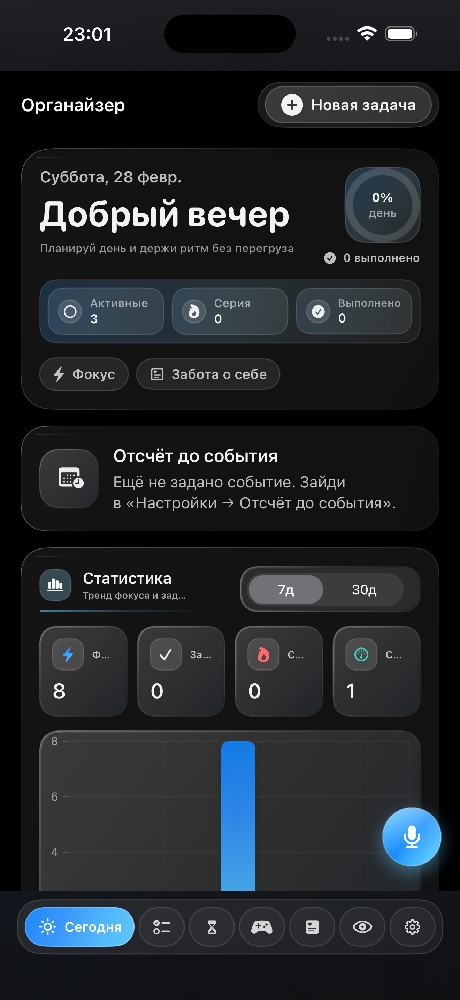
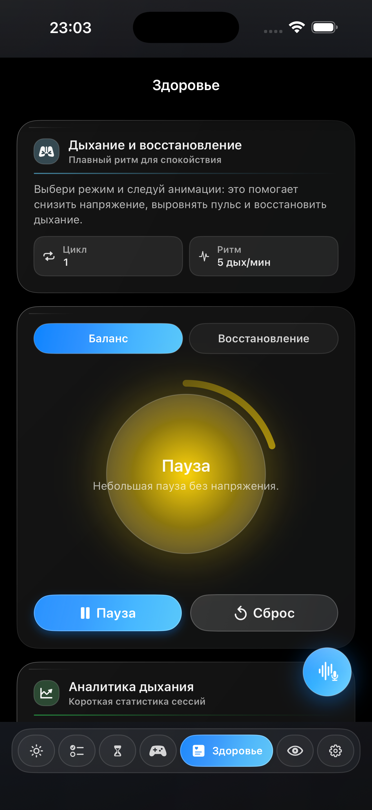
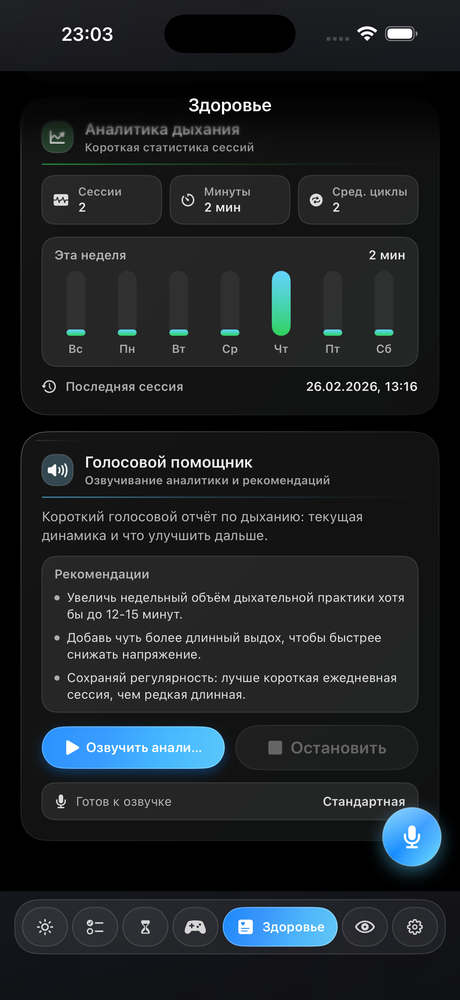
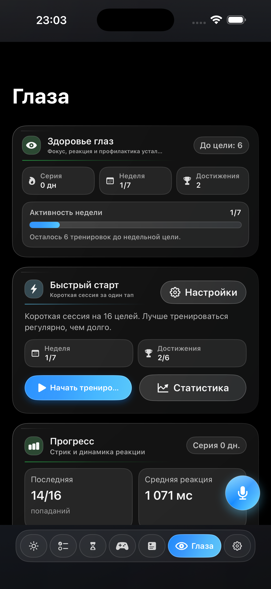
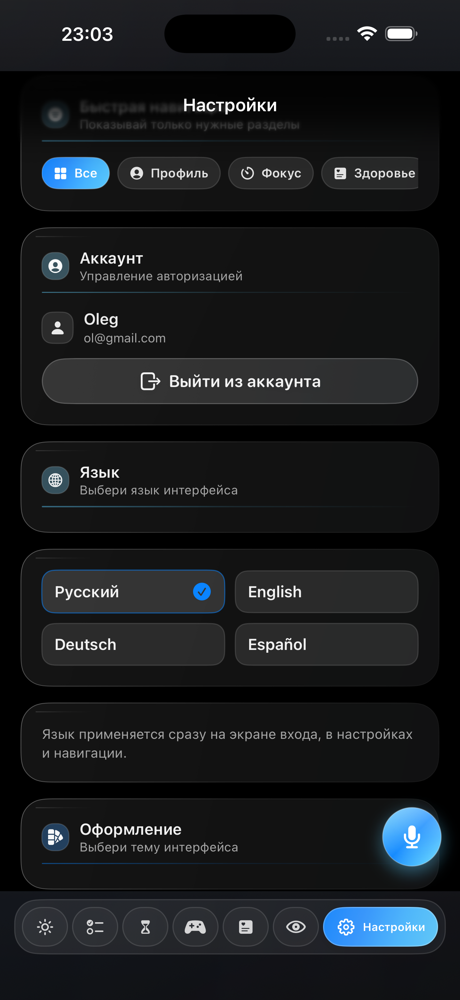

# Lippi

  
<strong>Personal focus, health routines, and voice assistance in one iPhone app.</strong>

  

    <a href="#english">English</a>
    ·
    <a href="#русский">Русский</a>
  

  

    
    
    
    
    
  

---

## License Notice / Лицензионное уведомление

<table>
  <tr>
    <td width="50%" align="left" valign="top">
      <strong>English</strong> 
      This repository is proprietary. Copying, modifying, building, using, and distributing the code without explicit written permission from the copyright holder is strictly prohibited.
        
      Full terms:
      <a href="LICENSE"><code>LICENSE (EN)</code></a>,
      <a href="LICENSE.ru.md"><code>LICENSE.ru.md (RU)</code></a>
    </td>
    <td width="50%" align="left" valign="top">
      <strong>Русский</strong> 
      Этот репозиторий является проприетарным. Копирование, изменение, сборка, использование и распространение кода без явного письменного разрешения правообладателя строго запрещены.
        
      Полные условия:
      <a href="LICENSE.ru.md"><code>LICENSE.ru.md (RU)</code></a>,
      <a href="LICENSE"><code>LICENSE (EN)</code></a>
    </td>
  </tr>
</table>

---

## Screenshots / Скриншоты

  
  
  

  
  
  

  

Home · Tasks · Health · Health Analytics · Eyes · Settings · Voice Assistant

---

## Latest Changes / Последние изменения

  

    
    
    
    
  

<table>
  <tr>
    <td width="50%" align="left" valign="top">
      <h3>English</h3>
      
<strong>A complete interaction, visual, and local-AI update focused on trustworthy planning and smooth daily use.</strong>

      <ul>
        <li><strong>Smart Goals:</strong> a new entry point on the Today screen turns a goal, available time, constraints, and preferred pace into a phased roadmap and the first Lippi tasks.</li>
        <li><strong>Evidence-first planning:</strong> Lippi selects up to two relevant open references from a curated catalog, retrieves concise excerpts in parallel, and shows every source in the roadmap. The user’s goal is never sent to those public sources.</li>
        <li><strong>Grounded local AI:</strong> the planner distinguishes known facts, assumptions, and clarifying questions. A strict Ollama JSON Schema prevents incomplete plans; invented metrics, testimonials, demand, revenue, and guaranteed outcomes are blocked, and duplicate milestones are removed defensively.</li>
        <li><strong>Mac-first Ollama provider:</strong> Smart Goals can use a local Ollama server over the home network before falling back to the system model. Settings include endpoint, model, enablement, and a connection check.</li>
        <li><strong>More capable compact model:</strong> the Mac configuration now defaults to <code>qwen3:1.7b</code>, with deterministic JSON-oriented settings, repeat protection, and a practical response timeout. The shared Xcode scheme warms the installed model before each build and keeps it ready for 30 minutes.</li>
        <li><strong>Transparent, readable roadmap UI:</strong> success criteria, first actions, assumptions, questions worth clarifying, evidence cards, milestones, habits, and risks now have distinct Liquid Glass sections. A modal processing animation shows evidence selection, route creation, and structure checks while the request is running.</li>
        <li><strong>Liquid Glass and performance polish:</strong> Today, settings, inputs, navigation, task states, Dynamic Island activities, and assistant surfaces use stronger system glass while performance-aware rendering, lighter transitions, and safe observer cleanup keep interaction responsive.</li>
        <li><strong>Localization and verification:</strong> Russian and English copy covers Smart Goals and Ollama. The project includes tests for Ollama configuration, Russian planning translation, and evidence-source selection, and was verified on iPhone 17 Simulator.</li>
      </ul>
    </td>
    <td width="50%" align="left" valign="top">
      <h3>Русский</h3>
      
<strong>Полное обновление взаимодействий, визуального стиля и локального ИИ с акцентом на достоверное планирование и плавное ежедневное использование.</strong>

      <ul>
        <li><strong>Умные цели:</strong> новый вход с главного экрана превращает цель, доступное время, ограничения и желаемый темп в поэтапную дорожную карту и первые задачи Lippi.</li>
        <li><strong>Планирование с опорой на источники:</strong> Lippi выбирает до двух подходящих открытых материалов из проверенного каталога, параллельно получает короткие выдержки и показывает каждый источник внутри маршрута. Текст цели пользователя в эти публичные источники не отправляется.</li>
        <li><strong>Достоверный локальный ИИ:</strong> планировщик разделяет известные факты, допущения и вопросы для уточнения. Строгая JSON Schema для Ollama предотвращает незавершённые планы; модель не должна выдумывать метрики, отзывы, спрос, выручку и гарантированные результаты, а повторяющиеся этапы дополнительно отсекаются.</li>
        <li><strong>Ollama на Mac - первый провайдер:</strong> Умные цели могут обращаться к локальному серверу Ollama в домашней сети до системной модели Apple. В настройках есть адрес, модель, включение и проверка подключения.</li>
        <li><strong>Более способная компактная модель:</strong> по умолчанию используется <code>qwen3:1.7b</code> с настройками для предсказуемого JSON, защитой от повторов и практичным таймаутом ответа. Общая схема Xcode разогревает установленную модель перед каждой сборкой и удерживает её готовой 30 минут.</li>
        <li><strong>Прозрачная и читаемая дорожная карта:</strong> критерии успеха, первые действия, допущения, вопросы, карточки оснований, этапы, привычки и риски разделены на понятные Liquid Glass-блоки. Пока идёт запрос, модальная анимация показывает подбор оснований, сборку маршрута и проверку структуры.</li>
        <li><strong>Liquid Glass и производительность:</strong> Today, настройки, поля ввода, навигация, состояния задач, активности Dynamic Island и ассистент получили более выразительное системное стекло; облегчённые переходы, адаптивный рендеринг и безопасная очистка observer-ов поддерживают отзывчивость интерфейса.</li>
        <li><strong>Локализация и проверка:</strong> Smart Goals и Ollama получили русский и английский тексты. Добавлены тесты конфигурации Ollama, перевода целей с русского и выбора источников; релиз проверен на iPhone 17 Simulator.</li>
      </ul>
    </td>
  </tr>
</table>

---

## English

### Product Overview
Lippi is a polished iOS productivity and wellbeing app that combines task planning, Pomodoro focus sessions, eye-care breaks, breathing recovery, health analytics, and a built-in voice assistant.  
The goal is simple: help users stay focused, recover faster, and keep a sustainable daily rhythm.

### Key Features
- Daily workflow: task planning, "Today" screen, and quick progress tracking.
- Focus engine: Pomodoro sessions, customizable timer behavior, and ringtone selection.
- Health tools: eye exercise section, breathing and recovery routines, concise analytics.
- Voice assistant: fast in-app actions, command recognition, and spoken guidance.
- Widgets: home/lock-screen widgets with useful quick entry points.
- Personalization: dynamic themes, adaptive full-screen backgrounds, liquid-glass style.
- Localization: Russian, English, German, and Spanish across the app.

### Technical Highlights
- Modular feature structure (`Features`, `Core`, `UI`, `Widgets`).
- SwiftUI-first architecture with reusable design system components.
- WidgetKit integration for glanceable productivity and assistant access.
- Localized language environment and shared app/widget bridge keys.

### Project Structure
- `Lippi/` - main iOS app target
- `Lippi/Features/` - product features (Today, Tasks, Health, Assistant, Settings, etc.)
- `Lippi/Core/` - localization, auth, theme, shared services
- `Lippi/UI/` - design system and reusable visual components
- `LippiWidgets/`, `OrganizerWidget/` - widget extensions
- `LippiTests/`, `LippiUITests/` - tests

### Run Locally
1. Clone the repository.
2. Open `Lippi.xcodeproj` in Xcode.
3. Select the `Lippi` scheme.
4. Build and run on iPhone or Simulator with iOS 18.5+.

### Status
Active development. UI quality, performance smoothness, and assistant intelligence are continuously improved.

### License
Proprietary software. All rights reserved.  
Copying, modifying, building, using, and distributing this project are strictly prohibited for third parties without explicit written permission from the copyright holder.  
Full texts: `LICENSE` (English), `LICENSE.ru.md` (Russian).

---

## Русский

### Описание продукта
Lippi - это аккуратное iOS-приложение для продуктивности и восстановления, которое объединяет планирование задач, Pomodoro-фокус, разминку глаз, дыхательные практики, аналитику здоровья и встроенного голосового помощника.  
Главная цель: помочь пользователю сохранять концентрацию, быстрее восстанавливаться и держать стабильный ритм дня.

### Ключевые возможности
- Ежедневная продуктивность: задачи, экран "Сегодня", быстрый контроль прогресса.
- Фокус-движок: Pomodoro-сессии, гибкие настройки таймера и выбор рингтонов.
- Инструменты здоровья: раздел для глаз, дыхание и восстановление, лаконичная аналитика.
- Голосовой помощник: быстрые команды внутри приложения и голосовые ответы.
- Виджеты: удобные виджеты для домашнего экрана и экрана блокировки.
- Персонализация: темы оформления, адаптивный фон на весь экран, liquid-glass стиль.
- Локализация: русский, английский, немецкий и испанский языки.

### Технические особенности
- Модульная структура (`Features`, `Core`, `UI`, `Widgets`).
- Архитектура на SwiftUI с переиспользуемой дизайн-системой.
- Интеграция с WidgetKit для быстрого доступа к ключевым функциям.
- Единая система локализации и общие ключи для связи приложения и виджетов.

### Структура проекта
- `Lippi/` - основной таргет iOS-приложения
- `Lippi/Features/` - модули функций (Today, Tasks, Health, Assistant, Settings и др.)
- `Lippi/Core/` - локализация, авторизация, темы, общие сервисы
- `Lippi/UI/` - дизайн-система и переиспользуемые визуальные компоненты
- `LippiWidgets/`, `OrganizerWidget/` - расширения виджетов
- `LippiTests/`, `LippiUITests/` - тесты

### Локальный запуск
1. Склонируйте репозиторий.
2. Откройте `Lippi.xcodeproj` в Xcode.
3. Выберите схему `Lippi`.
4. Запустите на iPhone или Simulator с iOS 18.5+.

### Статус
Проект активно развивается: улучшаются качество интерфейса, плавность работы и интеллект помощника.

### Лицензия
Проприетарное ПО. Все права защищены.  
Копирование, изменение, сборка, использование и распространение проекта третьими лицами строго запрещены без явного письменного разрешения правообладателя.  
Полные тексты: `LICENSE.ru.md` (русский), `LICENSE` (английский).
